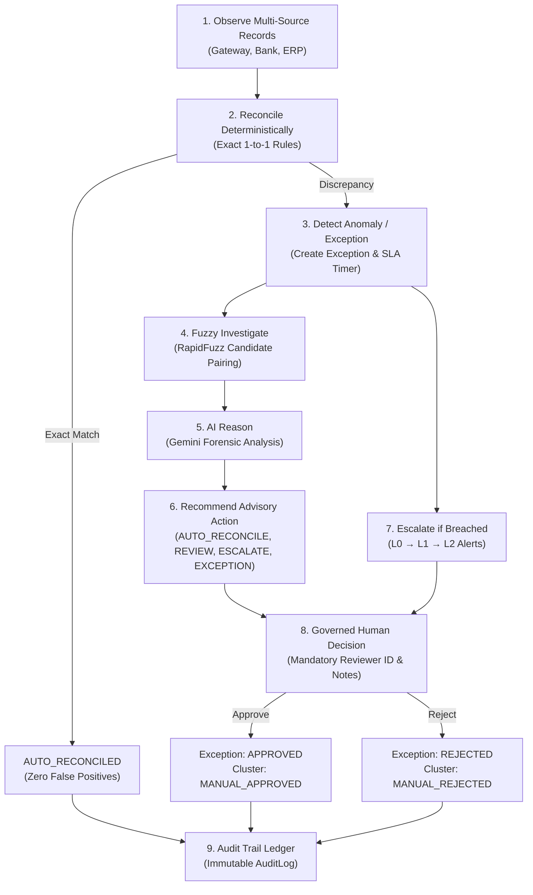

# ReconcileAI

**AI Finance Controller for Multi-Source Payment Reconciliation**
*Track 04: AI Finance Controller | Razorpay AI Buildathon*

> [!NOTE]
> **Educational & Buildathon Prototype Notice**
> ReconcileAI is an educational prototype and reference implementation built for the **Razorpay AI Buildathon (Track 04)**.
> **All financial data, transactions, bank statements, and payment records used in this system are 100% synthetic.**
> This system is **not a production Razorpay integration** and does not connect to real banking networks or live payment credentials.

---

## Executive Summary

**ReconcileAI** demonstrates a complete, closed-loop financial operations system designed to resolve discrepancies across **Payment Gateways**, **Bank Settlement Feeds**, and **ERP Accounting Ledgers**.

Modern payment operations struggle when digital transactions disagree across distributed ledgers due to network timeouts, unannounced gateway fee deductions, or bank reference truncation. ReconcileAI bridges this gap through a strictly governed 9-stage financial operations lifecycle:
`Observe → Reconcile → Detect Anomaly → Fuzzy Investigate → AI Reason → Recommend → Escalate → Human Decision → Audit`

The platform enforces these stages across core system layers:
1. High-throughput **deterministic matching rules** resolve exact matches instantly with 100% precision and zero false positives.
2. Unresolved breaks trigger **RapidFuzz similarity algorithms** to uncover candidate cluster relationships.
3. An **AI Finance Advisory Agent** (powered by Google Gemini with deterministic heuristic fallbacks) conducts deep forensic investigations and formulates risk-weighted recommendations.
4. **Human controllers retain 100% final approval and rejection authority**.
5. Every lifecycle event is permanently sealed into an **append-only, immutable audit trail**.

> **The Core Governance Principle:**
> **AI RECOMMENDS. HUMAN DECIDES.**
> The AI agent acts strictly as an advisory investigator—it possesses no authority to approve, reject, resolve, or mutate financial transaction state.

---

## Project Highlights

- **Three-Way Multi-Source Reconciliation**: Normalizes and reconciles merchant orders, payment gateway logs, and bank settlement statements.
- **Deterministic Exact Matching Engine**: Resolves provable 1-to-1 matches with 100% precision, ensuring zero false positives.
- **Fuzzy Evidence Investigation**: Utilizes token-sort and Levenshtein similarity via RapidFuzz to surface candidate clusters without unguided balance mutations.
- **Non-Binding AI Advisory Agent**: Structured discrepancy reasoning, risk classification, and confidence scoring via Gemini Flash (with heuristic fallbacks).
- **Human-in-the-Loop Governance**: Role-governed exception console requiring reviewer identification, mandatory resolution notes, and explicit verification sign-offs.
- **Cryptographic Webhook Security**: HMAC SHA-256 signature verification over raw request payloads to prevent perimeter tampering.
- **Webhook Idempotency & Replay Prevention**: Replay attack detection returning HTTP 409 Conflict for duplicate event IDs.
- **SLA Tracking & Governance**: Dynamic breach tracking across three operational statuses (`OK`, `WARNING`, `BREACHED`).
- **Three-Tier Escalation Hierarchy**: Automated role-based escalation across `L0` (Primary Reviewer), `L1` (Finance Supervisor), and `L2` (Finance Director).
- **Idempotent Notification Dispatch**: Prevents notification spam during repeated background escalation checks.
- **Immutable Append-Only Audit Trail**: Dedicated `AuditLog` table with ORM-level blockers on `UPDATE` and `DELETE` operations.
- **Decoupled Client-Server Architecture**: High-speed FastAPI REST backend (19 endpoints across 8 domains) and responsive Streamlit UI communicating strictly via HTTP.
- **Multi-Format Financial Reporting**: Flexible export options for CSV, XLSX, JSON, and Markdown summaries.
- **Empirical Ground-Truth Evaluation**: Rigorously benchmarked against 100 scenarios, 101 candidate clusters, and 289 raw transactions.
- **Hermetic Test Isolation**: 100% isolated SQLite test databases ensuring persistent development data is never modified by test suites.

---

## The Problem

In high-volume digital commerce, financial truth does not reside in a single database. Every customer payment creates records across three independent systems:

```
[Merchant ERP / Order System]      [Payment Gateway (e.g., Razorpay)]      [Bank Settlement Feed]
         Orders / Invoices                        Charges / Refunds                   Settlement Ledger
```

Because these systems run on separate infrastructure with distinct settlement cycles, records frequently disagree:
- **Amount Mismatches**: Gateway processing fees (MDR) or taxes deducted before settlement.
- **Missing Records**: Dropped webhooks or delayed bank end-of-day clearing.
- **Duplicate Charges**: Client retries resulting in dual gateway authorizations.
- **Timing & Date Delays**: Transactions clearing past the daily settlement cutoff.
- **Reference Truncation**: Core banking systems truncating merchant order UUIDs.
- **Partial Payments & Status Breaks**: Orders marked pending while payments succeeded.

Manual reconciliation creates massive operational backlog, delays financial close, and exposes businesses to unmonitored Value-at-Risk (VaR).

---

## The Solution

ReconcileAI automates the repetitive heavy lifting while strictly protecting financial safety through the documented 9-stage financial operations lifecycle:
`Observe → Reconcile → Detect Anomaly → Fuzzy Investigate → AI Reason → Recommend → Escalate → Human Decision → Audit`



### Core Tenets
1. **Mathematical certainty comes first**: Exact matches are handled deterministically at microsecond speeds.
2. **Probabilistic tools investigate, not resolve**: Fuzzy matching and AI LLMs surface evidence and explain variances; they never alter ledger state.
3. **Humans own exception sign-off**: Only authenticated financial controllers can approve or reject financial exceptions.
4. **Permanent auditability**: Every event, recommendation, and human sign-off is permanently sealed in an immutable log.

---

## Architecture Overview

ReconcileAI is designed as a decoupled, service-oriented system:

```
┌─────────────────────────────────────────────────────────────────────────────┐
│                       Streamlit Operations Dashboard                         │
│   (5-Minute Demo | Webhook Sim | Controls | Workbench | Audit | Benchmark)   │
└──────────────────────────────────────┬──────────────────────────────────────┘
                                       │ HTTP REST API (JSON)
┌──────────────────────────────────────▼──────────────────────────────────────┐
│                            FastAPI Backend Engine                           │
│   ┌───────────────────────────┬───────────────────────────┬─────────────┐   │
│   │    Webhook Verification   │   Reconciliation Engine   │     SLA     │   │
│   │    (HMAC SHA-256 + 409)   │   (Deterministic Engine)  │  Governance │   │
│   ├───────────────────────────┼───────────────────────────┼─────────────┤   │
│   │   RapidFuzz Similarity    │    AI Finance Controller  │   Report    │   │
│   │   (Levenshtein / Token)   │   (Gemini + Fallback)     │   Exporter  │   │
│   └───────────────────────────┴───────────────────────────┴─────────────┘   │
└──────────────────────────────────────┬──────────────────────────────────────┘
                                       │ SQLAlchemy ORM
┌──────────────────────────────────────▼──────────────────────────────────────┐
│                    SQLite Database (reconcile_ai.db)                        │
│   ┌───────────────────────────┬───────────────────────────┬─────────────┐   │
│   │   Transactions & Sources  │   Candidate Match Clusters│ Exceptions  │   │
│   ├───────────────────────────┼───────────────────────────┼─────────────┤   │
│   │   Webhook Events (Audit)  │   Escalations & Alerts    │ AuditLog    │   │
│   │                           │                           │(Append-Only)│   │
│   └───────────────────────────┴───────────────────────────┴─────────────┘   │
└─────────────────────────────────────────────────────────────────────────────┘
```

For the comprehensive architecture breakdown, data models, state machines, and sequence diagrams, refer to the **[Architecture Documentation](docs/architecture.md)**.

---

## AI Governance & Safety Boundaries

In enterprise financial operations, unconstrained AI write authority introduces unacceptable regulatory and accounting risks. ReconcileAI enforces strict architectural boundaries:

| Dimension | Permitted for AI | Prohibited for AI |
| :--- | :--- | :--- |
| **Data Access** | Read-only inspection of normalized transaction evidence. | Direct balance mutations or transaction alterations. |
| **Analysis** | Contextual forensic reasoning, pattern detection, and risk scoring. | Making final or binding financial determinations. |
| **Output** | Structured non-binding recommendations (`AUTO_RECONCILE`, `REVIEW`, etc.). | Autonomous approval or rejection of exceptions. |
| **Persistence** | Storing advisory reasoning and confidence scores in audit records. | Updating exception status to `APPROVED` or `REJECTED`. |
| **Availability** | Seamless failover to deterministic heuristic logic if LLM times out. | Halting reconciliation operations during network failure. |

```
===============================================================================
                        AI RECOMMENDS. HUMAN DECIDES.
   AI has no authority to approve, reject, resolve, or mutate transaction state.
===============================================================================
```

---

## Reconciliation Pipeline

Reconciliation executes across two distinct lifecycles:

### Path A — Exact Deterministic Match
```text
Three-Source Records (Gateway + Bank + ERP)
                  ↓
Deterministic Match Rules (Ref ID + Exact Amount)
                  ↓
    Status: AUTO_RECONCILED
    Audit Event: TRANSACTION_RECONCILED
```
- Operates at **> 1,500 transactions/second**.
- Achieves **100% precision** with zero false positive pairings.

### Path B — Discrepancy Investigation & Governed Resolution
```text
Discrepancy Detected (Variance, Reference Truncation, Timing Lag)
                  ↓
     Exception Created (Status: OPEN, SLA: OK)
                  ↓
RapidFuzz Scoring (Investigative Candidate Pairing)
                  ↓
AI Advisory Analysis (Gemini / Heuristic Forensic Report)
                  ↓
SLA Monitoring (Triggers L0 → L1 → L2 Escalations if unaddressed)
                  ↓
Human Decision Screen (Mandatory Reviewer ID, Notes & Verification)
        ├── APPROVE ──► Exception: APPROVED | Cluster: MANUAL_APPROVED
        └── REJECT  ──► Exception: REJECTED | Cluster: MANUAL_REJECTED
                  ↓
      Immutable Audit Trail (EXCEPTION_APPROVED / EXCEPTION_REJECTED)
```

---

## Streamlit Operations Dashboard

The Streamlit dashboard (`dashboard/app.py`) provides an interactive interface for finance controllers:

1. **⚡ 5-Minute Demo**: A guided seven-stage presentation runbook demonstrating the full lifecycle from webhook ingestion to benchmark evaluation.
2. **📥 Webhook Simulator**: Interactive perimeter testing tool supporting valid HMAC SHA-256 signatures, tampered payloads (401), and replay attempts (409).
3. **🔄 Operations & Controls**: Triggers the multi-source reconciliation pipeline, displays live cluster metrics, and demonstrates safe idempotent replays.
4. **🔎 Exception Workbench**: Discrepancy investigation workspace featuring side-by-side evidence inspection, SLA countdown timers, and escalation badges.
5. **🤖 AI Advisory Panel**: Displays non-binding forensic insights, confidence scores, fee detection explanations, and risk assessments.
6. **👤 Human Decision Console**: Governed sign-off interface with mandatory reviewer ID input, resolution notes, and confirmation gating.
7. **📜 Immutable Audit Trail**: Searchable, tamper-evident audit ledger displaying actor, action, timestamp, old/new states, and audit reasons.
8. **📊 Benchmark Runner**: Runs the ground-truth evaluation suite on demand and renders live accuracy, precision, throughput, and VaR metrics.
9. **📈 Financial Reports & Exports**: Generates downloadable reconciliation packages in CSV, XLSX, JSON, and Markdown formats.

---

## Evaluation & Ground-Truth Benchmarking

ReconcileAI rejects unverified claims by measuring performance against a structured ground-truth test suite:

### Fixed Evaluation Population
- **100 Ground-Truth Scenarios**: Curation spanning 9 discrepancy categories (*amount mismatch, missing bank transaction, missing gateway transaction, duplicate, date mismatch, reference mismatch, partial, failed, exact match*).
- **101 Candidate Match Clusters**: Realized multi-source clusters routed through the matching engine.
- **289 Raw Source Transactions**: Raw transactions processed across orders, gateway logs, and bank statements.

### Benchmark Results (Phase 13 Baseline)

| Metric | Measured Baseline | Target Standard | Operational Significance |
| :--- | :--- | :--- | :--- |
| **Match Precision** | **100.0%** | $\ge 99.5\%$ | **Zero false positives**. No unrelated money is ever matched. |
| **Classification Accuracy** | **100.0%** | $\ge 95.0\%$ | TP=58, TN=42, FP=0, FN=0 across 100 ground-truth scenarios. |
| **Match Recall** | **100.0%** | $\ge 95.0\%$ | All true financial matches identified. |
| **Auto-Reconciliation Rate** | **57.43%** | $\ge 50.0\%$ | Straight-through processing for 58 clean match clusters. |
| **Human-Review Routing Rate** | **42.57%** | $\le 50.0\%$ | 43 candidate clusters with discrepancies routed safely to human controllers. |
| **Unresolved Value-at-Risk** | **₹971,991.00** | Monitored | Total value flagged for human review across discrepant clusters. |
| **Total Transaction Value** | **₹2,406,960.00** | Benchmark | Total financial value processed across raw source records. |
| **Fuzzy-Assisted Rate** | **0.0% (Baseline)** | Diagnostic | *Note: Original Phase 13 benchmark evaluated pure deterministic engine.* |
| **AI-Assisted Rate** | **0.0% (Baseline)** | Diagnostic | *Note: AI operates downstream as an investigative layer.* |

*For complete evaluation methodology and confusion matrix analysis, see the [Architecture Documentation](docs/architecture.md).*

---

## Repository Structure

```
ReconcileAI/
├── backend/
│   ├── main.py                  # FastAPI Application & 19 Public Endpoints
│   ├── config.py                # Pydantic BaseSettings & Environment Loading
│   ├── database.py              # SQLite Engine, SessionLocal & Model Registry
│   ├── models/                  # SQLAlchemy ORM Models
│   │   ├── transaction.py       # Raw Multi-Source Transactions
│   │   ├── reconciliation.py    # Candidate Match Clusters & Results
│   │   ├── exception_record.py  # Exceptions, SLA Tracking & Escalations
│   │   ├── audit_log.py         # Append-Only Audit Trail
│   │   ├── webhook_event.py     # Ingested Webhook Signatures & Payloads
│   │   └── notification.py      # Escalation Alerts & Notification Records
│   ├── schemas/                 # Pydantic Schemas & Request/Response Models
│   └── services/                # Specialized Core Business Logic
│       ├── matching_engine.py   # High-Speed Deterministic Matching
│       ├── fuzzy_matcher.py     # RapidFuzz Similarity Scorer
│       ├── ai_controller.py     # Gemini Advisory & Heuristic Fallback
│       ├── exception_service.py # Lifecycle State & Concurrency Control
│       ├── sla_engine.py        # SLA Calculation & L0-L2 Escalation
│       ├── audit_service.py     # Immutable Audit Log Writer
│       ├── webhook_service.py   # HMAC Verification & Replay Protection
│       └── reporting_service.py # CSV, XLSX, JSON & Markdown Exporter
├── dashboard/
│   ├── app.py                   # Streamlit Operations Dashboard
│   └── api_client.py            # Typed HTTP API Client for FastAPI Backend
├── docs/
│   ├── architecture.md          # Full Technical Architecture Specification
│   ├── api.md                   # Complete REST API Reference (19 Endpoints)
│   ├── learning-guide.md        # Student Technical & Pedagogical Guide
│   └── demo.md                  # 5-Minute Live Presentation Runbook & Q&A
├── data/                        # Synthetic Datasets & Ground-Truth Test Data
├── scripts/                     # Data Generation & Diagnostic Scripts
├── tests/                       # Hermetic Automated Test Suite (Pytest)
├── requirements.txt             # Python Package Dependencies
├── .env.example                 # Environment Variable Template
└── README.md                    # Project Documentation
```

---

## Getting Started

### Prerequisites
- **Python Runtime**: Python 3.11 or 3.12
- **Operating System**: macOS, Linux, or Windows (PowerShell)
- **Virtual Environment**: Recommended (`venv` or `conda`)

### 1. Clone & Environment Setup
```bash
# Clone the repository
git clone https://github.com/Polisetty-Cyril/ReconcileAI.git
cd ReconcileAI

# Create and activate virtual environment
python -m venv venv
# On Linux/macOS:
source venv/bin/activate
# On Windows PowerShell:
.\venv\Scripts\Activate.ps1

# Install required dependencies
pip install -r requirements.txt
```

### 2. Configure Environment Variables
Copy the template configuration file:
```bash
cp .env.example .env
```

Default `.env` settings:
```ini
DATABASE_URL=sqlite:///./reconcile_ai.db
WEBHOOK_SECRET=test_secret_key_12345
GEMINI_API_KEY=your_gemini_api_key_here  # Optional: heuristic fallback active if empty
LOG_LEVEL=INFO
```

### 3. Launch the Backend Engine
Start the FastAPI server in your first terminal:
```bash
python -m uvicorn backend.main:app --reload --port 8000
```
- Direct API Health: `http://localhost:8000/health`
- Interactive OpenAPI Docs: `http://localhost:8000/docs`

### 4. Launch the Operations Dashboard
Start the Streamlit dashboard in your second terminal:
```bash
streamlit run dashboard/app.py
```
- The dashboard automatically opens in your browser at `http://localhost:8501`.

### 5. Run Automated Tests
Execute the comprehensive hermetic test suite:
```bash
pytest -v tests/
```
*(All tests use isolated temporary SQLite databases in memory/temp files; your local `reconcile_ai.db` is never touched).*

---

## Documentation Directory

Explore the complete documentation suite:

| Document | Purpose & Target Audience |
| :--- | :--- |
| **[Architecture Documentation](docs/architecture.md)** | Deep technical guide covering layered architecture, sequence flows, database schemas, SLA algorithms, and security boundaries. |
| **[API Reference](docs/api.md)** | Developer-facing reference detailing all 19 FastAPI endpoints across 8 domain categories with curl commands and schema definitions. |
| **[Student Learning Guide](docs/learning-guide.md)** | Pedagogical runbook explaining core financial concepts, why reconciliation breaks, and step-by-step code walkthroughs. |
| **[5-Minute Demo Runbook](docs/demo.md)** | Live presentation script, 7-stage runbook, 2-minute lightning flow, troubleshooting, and judge Q&A prep. |

---

## Security, Safety & Integrity Boundaries

ReconcileAI enforces enterprise-grade security and safety practices:

- **Perimeter Defense**: Webhook authentication via HMAC SHA-256 prevents unauthorized event injection.
- **Strict Idempotency**: Duplicate webhook event IDs are rejected with HTTP 409 Conflict.
- **Append-Only Ledger**: Append-only audit behavior enforced through SQLAlchemy ORM protections (intercepting `before_update`, `before_delete`, and `Session.do_orm_execute` to raise `AuditLogImmutableError`).
- **Human Authority Preservation**: Discrepancies can only be resolved by authenticated human controllers via explicit sign-offs.
- **Hermetic Testing**: Zero coupling between test suites and persistent development databases.
- **Safe Fallbacks**: Heuristic advisory algorithms activate automatically if cloud AI services are unreachable.
- **Data Privacy & Grounding**: All demo and test data is 100% synthetic; no real financial accounts or customer PII are ever collected or processed.
