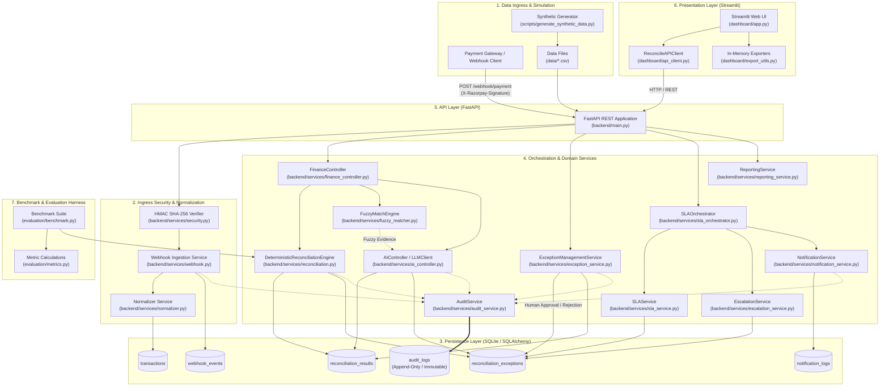
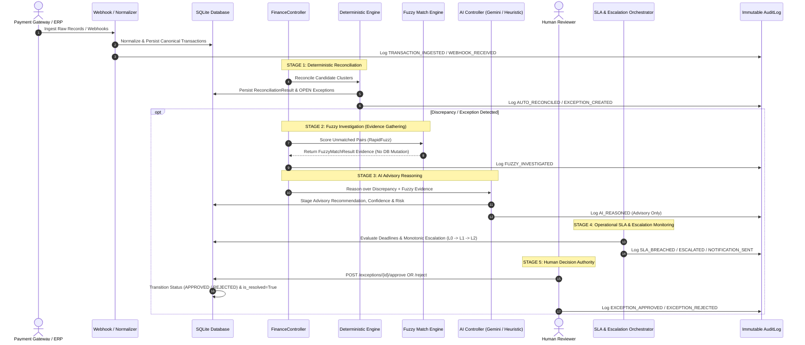
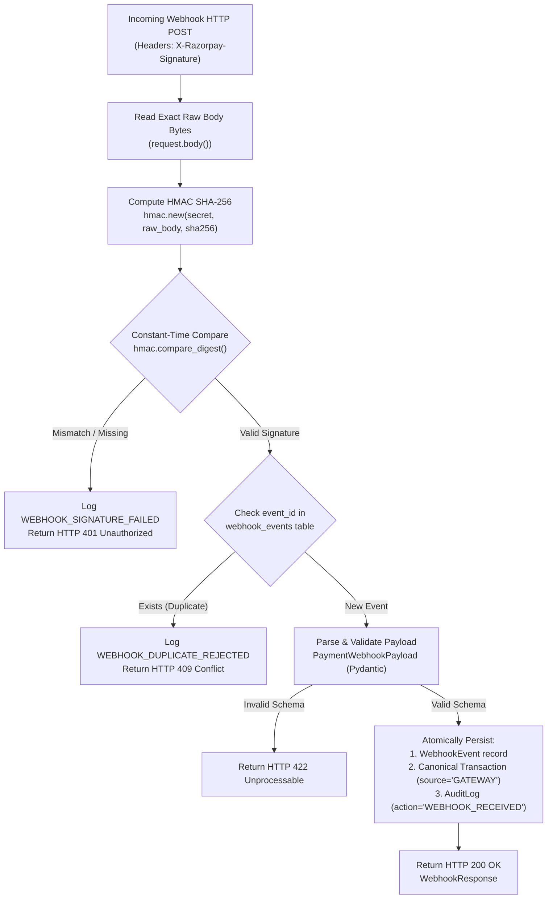
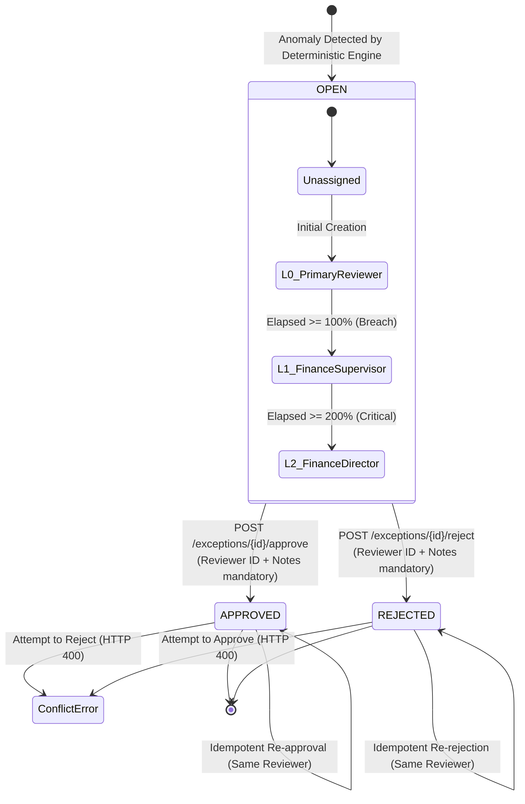
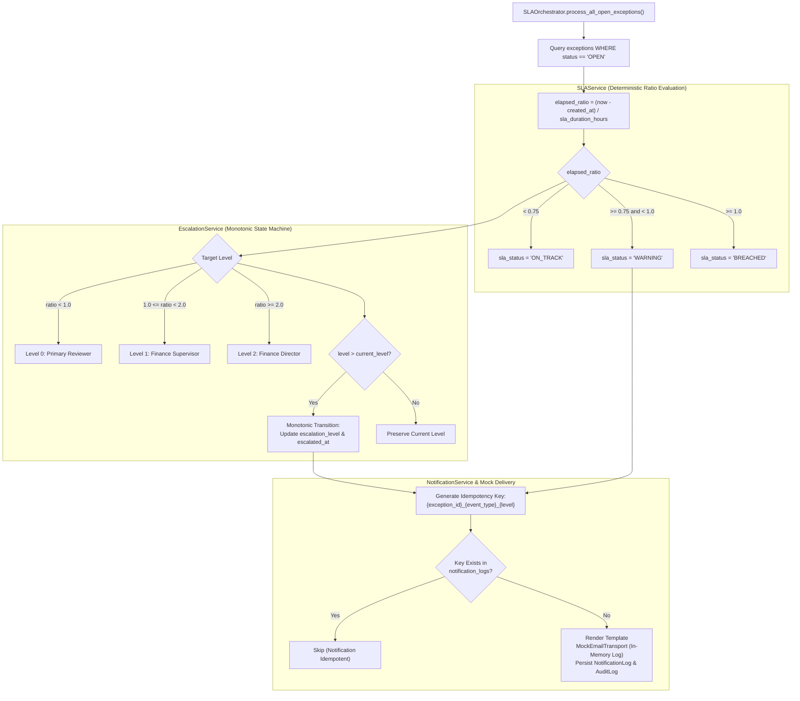
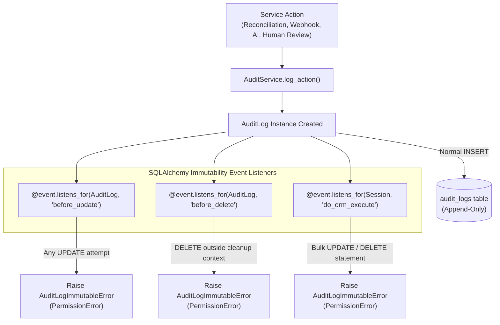

# ReconcileAI — Architecture & Technical Design

## 1. System Overview

**ReconcileAI** is an intelligent, multi-source financial reconciliation and exception-governance platform developed for **Track 04: AI Finance Controller** in the **Razorpay AI Buildathon**.

In modern financial operations, businesses process transactions across disparate, asynchronous platforms:
- **Payment Gateways** (e.g., Razorpay payment authorizations, captures, refunds, and webhook events)
- **Banking Partners** (e.g., settlement credits, transaction fee debits, nodal accounts, bank statement UTR records)
- **Internal ERP / General Ledgers** (e.g., order billing records, merchant settlement journals, invoices)

Timing delays, payment method surcharges, currency rounding, gateway fees, bank processing errors, and intermittent network timeouts inevitably produce discrepancies between these three record sources.

ReconcileAI solves this multi-source challenge by coupling **authoritative deterministic matching** with **bounded fuzzy investigation (RapidFuzz)**, **structured AI advisory reasoning (Gemini / Heuristic Fallback)**, **deterministic operational SLA escalation**, and **human-in-the-loop (HITL) decision authority**, underpinned by a **strictly immutable, append-only audit trail**.

> [!IMPORTANT]
> **Educational & Buildathon Scope Notice:**
> ReconcileAI is an educational prototype and buildathon reference implementation. It runs exclusively on **100% synthetic financial transaction data** generated from realistic Indian financial templates (INR currency, standard gateway/bank schemas). It does not connect to live banking networks, real Razorpay merchant credentials, or real customer accounts.

---

## 2. High-Level Architecture

The following diagram illustrates the complete end-to-end component topology of ReconcileAI, from data generation and webhook ingress through deterministic reconciliation, fuzzy evidence gathering, advisory AI reasoning, human decision governance, SLA monitoring, and immutable auditing.



---

## 3. Layered Architecture

ReconcileAI is structured strictly into five decoupled layers with clear unidirectional dependencies:

```
Presentation (Streamlit)
       ↓ HTTP REST
API Layer (FastAPI)
       ↓ Domain Invocations
Orchestration & Domain Services (Python)
       ↓ ORM / Event Hooks
Persistence Layer (SQLAlchemy + SQLite)
```

### 3.1 Presentation Layer (`dashboard/`)
* **Technology**: Streamlit, Pandas, OpenPyXL.
* **Key Components**:
  * [`dashboard/app.py`](../dashboard/app.py): Modular multi-view dashboard implementing 8 functional interfaces (Executive Summary, Exception Workbench, Transaction Explorer, Reconciliation Results, Immutable Audit Trail, Reports & Exports, Operations & Controls, and 5-Minute Guided Demo).
  * [`dashboard/api_client.py`](../dashboard/api_client.py): Clean typed HTTP client encapsulated in `ReconcileAPIClient`. Handles endpoint URLs, timeouts, network failure translation into structured `APIStatusError` and `APITimeoutError`, and session state management.
  * [`dashboard/export_utils.py`](../dashboard/export_utils.py): Pure in-memory streaming export utilities converting pandas DataFrames and dictionaries to CSV, multi-tab Excel (`.xlsx`), formatted JSON, and Markdown text without writing temporary files to disk.

### 3.2 API Layer (`backend/main.py`)
* **Technology**: FastAPI, Pydantic v2, Uvicorn.
* **Key Components**:
  * Unified REST application hosting 19 public endpoints.
  * Dependency injection for database sessions (`get_db`) ensuring request-scoped transactional boundaries and automatic session teardown.
  * Pydantic schemas (`backend/schemas/`) validating request payloads and formatting response contracts.
  * Global exception handlers intercepting HTTP errors, validation failures, and database constraints.

### 3.3 Orchestration & Domain Services (`backend/services/`)
* **Technology**: Python 3.10+, RapidFuzz, Google GenAI SDK (Gemini).
* **Key Components**:
  * `FinanceController`: Central coordinator managing the multi-stage lifecycle from raw transaction observation to deterministic matching, fuzzy investigation, and AI advisory generation.
  * `DeterministicReconciliationEngine`: Core mathematical and rule-based clustering engine executing 3-way matching across Gateway, Bank, and ERP records.
  * `FuzzyMatchEngine`: Sub-string and token-ratio comparison engine using RapidFuzz for pairwise scoring and candidate discovery.
  * `AIController`: LLM orchestrator leveraging Google Gemini (with deterministic heuristic fallback) to produce structured advisory reasoning, root-cause classifications, confidence scores, and recommended actions.
  * `ExceptionManagementService`: Human reviewer state machine governing exception queues, approvals, rejections, reviewer attribution, notes, and conflict prevention.
  * `SLAService`: Deterministic deadline and elapsed-time evaluator for open exceptions.
  * `EscalationService`: Monotonic state machine transitioning exception ownership across operational management tiers (L0 $\rightarrow$ L1 $\rightarrow$ L2).
  * `SLAOrchestrator`: Operational pipeline coordinating SLA calculation, escalation transitions, idempotent notification creation, and mock delivery.
  * `NotificationService` & `MockEmailTransport`: Template renderer and idempotent dispatch logger for operational alerts.
  * `AuditService`: Append-only recording service logging all domain mutations, security rejections, and reviewer actions.
  * `ReportingService`: Statistical aggregator computing executive KPIs, Value-at-Risk (VaR), volume metrics, and breakdown distributions.
  * `WebhookSimulatorService`: Gateway webhook processor enforcing HMAC validation, schema extraction, idempotency, and canonical transaction creation.

### 3.4 Persistence Layer (`backend/models/`, `backend/database.py`)
* **Technology**: SQLAlchemy ORM, SQLite (`reconcile_ai.db`).
* **Key Models**:
  * `Transaction`: Canonical multi-source transaction table storing standardized records (`source` in `GATEWAY`, `BANK`, `ERP`).
  * `WebhookEvent`: Ingress event log recording raw webhook payloads, HMAC signatures, and delivery timestamps.
  * `ReconciliationResult`: Match cluster record linking 1-to-3 transactions, match status, discrepancy amount, rule triggered, and AI recommendation metadata.
  * `ReconciliationException`: Actionable discrepancy record tracking category, severity, status (`OPEN`, `APPROVED`, `REJECTED`), reviewer attribution, SLA deadline, and escalation level.
  * `NotificationLog`: Operational notification record capturing recipient, escalation level, message body, and delivery status.
  * `AuditLog`: Immutable, append-only log record protected by SQLAlchemy lifecycle event hooks.

### 3.5 Evaluation & Benchmark Harness (`evaluation/`)
* **Technology**: Python, Pytest.
* **Key Components**:
  * `evaluation/benchmark.py`: Systematic evaluation harness running deterministic reconciliation against 100 labeled ground-truth scenarios (289 raw transactions).
  * `evaluation/metrics.py`: Statistical metric suite measuring classification accuracy, precision, recall, F1-score, auto-reconciliation rate, review routing rate, throughput, and financial discrepancy accuracy.

---

## 4. End-to-End Financial Lifecycle

ReconcileAI enforces a disciplined nine-stage lifecycle for every transaction set. Every stage has explicit responsibilities, inputs, outputs, and financial mutation boundaries:



### Detailed Lifecycle Stages

| Stage | Name | Responsible Component | Input | Output | Mutates Financial State? | Requires Human Authority? |
| :--- | :--- | :--- | :--- | :--- | :--- | :--- |
| **1** | **Observe** | `Normalizer`, `WebhookService` | Raw payloads, CSVs, API JSON | Canonical `Transaction` rows | No (Ingestion only) | No |
| **2** | **Reconcile** | `DeterministicReconciliationEngine` | Canonical transactions | `ReconciliationResult`, `ReconciliationException` | Yes (Generates match & discrepancy records) | No (Deterministic rules) |
| **3** | **Detect Anomaly** | `DeterministicReconciliationEngine` | Clustered transactions | Identified discrepancy (Amount, Missing leg, Status, Timing) | Yes (Creates `OPEN` exception) | No |
| **4** | **Fuzzy Investigate** | `FuzzyMatchEngine` (RapidFuzz) | Unmatched transaction pairs | `FuzzyMatchResult` (Composite score, token metrics) | **No** (Evidence gathering only) | No |
| **5** | **AI Reason** | `AIController` (Gemini / Heuristic) | Result + Exception + Fuzzy evidence | `AIControllerResult` (Root cause, confidence, risk, advice) | **No** (Advisory metadata only) | No |
| **6** | **Recommend** | `FinanceController` | Combined deterministic + AI output | Enriched reconciliation summary | **No** (Advisory summary) | No |
| **7** | **Escalate** | `SLAOrchestrator`, `EscalationService` | `OPEN` exceptions, current UTC time | Updated SLA status, escalation tier (L0/L1/L2), alerts | No (Operational metadata only) | No |
| **8** | **Human Decision** | `ExceptionManagementService` | Reviewer ID, decision (`APPROVE`/`REJECT`), notes | Updated exception status, resolved reconciliation result | **Yes (Authoritative resolution)** | **YES (Mandatory)** |
| **9** | **Audit Trail** | `AuditService`, `AuditLog` | Lifecycle event parameters | Append-only, immutable `AuditLog` entry | No (Read-only audit record) | No |

---

## 5. Deterministic + Fuzzy + AI Decision Boundary

A core design principle of ReconcileAI is the **strict separation of concerns between deterministic rule matching, fuzzy evidence generation, and generative AI reasoning**:

```mermaid
flowchart LR
    subgraph STAGE1["Stage 1: Deterministic Engine"]
        RULE["Exact Rules<br/>(Order ID, Amount, Reference UTR)"]
        MATCH{"Exact Match?"}
        AUTO["AUTO_RECONCILED<br/>(Authoritative Match)"]
        DISC["DISCREPANCY / UNRESOLVED<br/>(Create Exception)"]
    end

    subgraph STAGE2["Stage 2: Fuzzy Match Engine"]
        FUZZ["RapidFuzz Similarity<br/>(Token Sort, Partial Ratio)"]
        EVID["FuzzyMatchResult<br/>(Similarity Evidence: 0-100)"]
    end

    subgraph STAGE3["Stage 3: AI Advisory Controller"]
        GEMINI["Gemini 2.5 Flash / Fallback"]
        STRUCT["Structured Output<br/>(Pydantic Schema)"]
        ADVICE["AI Recommendation<br/>(Advisory Only - Non-Binding)"]
    end

    subgraph STAGE4["Stage 4: Human Governance"]
        HUMAN["Human Reviewer<br/>(Workbench UI / REST API)"]
        FINAL["Authoritative Decision<br/>(APPROVED / REJECTED)"]
    end

    RULE --> MATCH
    MATCH -- Yes --> AUTO
    MATCH -- No --> DISC
    DISC --> FUZZ
    FUZZ --> EVID
    EVID --> GEMINI
    DISC --> GEMINI
    GEMINI --> STRUCT
    STRUCT --> ADVICE
    ADVICE -. "Presents Advice & Context" .-> HUMAN
    HUMAN --> FINAL
```



### Why This Boundary Exists
1. **Financial Determinism is Non-Negotiable**: An LLM must never be allowed to balance ledgers or claim two transactions match simply because text looks similar. Mathematical and rule-based clustering must remain authoritative for exact reconciliations.
2. **Fuzzy Matching Produces Evidence, Not Decisions**: `FuzzyMatchEngine` uses Levenshtein distance and token sort ratios to quantify how closely an unlinked bank UTR or order description matches a gateway record. This score is treated strictly as *evidence* passed to the AI advisory layer, not an autonomous settlement trigger.
3. **AI Is Advisory and Non-Binding**:
   - The AI controller produces root-cause analysis, risk categorization (`LOW`, `MEDIUM`, `HIGH`), and suggested actions (`INVESTIGATE_FEE_STRUCTURE`, `REQUEST_BANK_STATEMENT`, `POST_MANUAL_ADJUSTMENT`).
   - The AI controller has **zero authority** to mark `is_resolved = True`, cannot change exception status to `APPROVED` or `REJECTED`, and cannot alter transaction monetary amounts.
4. **Human Authority Closes the Loop**: Only an authenticated human reviewer submitting explicit identity and rationale through the API or dashboard can transition an exception to `APPROVED` or `REJECTED`.

---

## 6. Webhook Architecture & Security

Payment gateways inform merchant backends of real-time state changes via webhooks. ReconcileAI includes a production-grade webhook ingestion architecture (`POST /webhook/payment`):



### Security Guarantees
* **Raw Body HMAC Verification**: Signatures are verified against the raw request byte stream, eliminating JSON serialization discrepancies or hash manipulation.
* **Timing-Attack Resistance**: Signature comparison uses `hmac.compare_digest()` to ensure constant-time execution.
* **Strict Replay & Idempotency Protection**: Every webhook carries a unique `event_id`. If an `event_id` is replayed, the request is rejected with `HTTP 409 Conflict`, and an immutable `WEBHOOK_DUPLICATE_REJECTED` audit log is recorded.
* **Safe Audit on Failure**: When an invalid signature arrives, the system does *not* trust unverified JSON contents. An audit log is recorded attributing the failure to `WEBHOOK_GATEWAY` without corrupting transactional tables.

---

## 7. Exception Management & Human Governance

When the deterministic engine detects discrepancies (e.g., fee mismatches, amount variance, or missing settlement legs), an actionable `ReconciliationException` is created in state `OPEN`.



### Governance Rules
1. **Mandatory Human Attribution**: Approving or rejecting an exception requires a verified `reviewer_id` and explanatory `notes`. Anonymous or system-automated resolution of exceptions is prohibited.
2. **Atomic State Synchronization**: When an exception is approved or rejected:
   - The exception record status transitions to `APPROVED` or `REJECTED`, recording `resolved_by` and `resolved_at`.
   - The linked `ReconciliationResult` is updated: `is_resolved = True` and `final_decision = 'MANUAL_APPROVED'` or `'MANUAL_REJECTED'`.
   - An immutable `AuditLog` entry is staged and committed atomically in the same database transaction.
3. **Idempotency & Conflict Prevention**:
   - Re-submitting the exact same decision by the same reviewer returns the current record safely without double-updating or duplicate logging.
   - Submitting a conflicting decision (e.g., attempting to approve an already rejected exception) is rejected with `HTTP 400 Bad Request`.

---

## 8. SLA, Escalation & Notification Architecture

Exceptions require time-bounded review to prevent financial leakage and regulatory settlement breaches. ReconcileAI implements an operational SLA and escalation state machine.

> [!NOTE]
> **Prototype Configuration Notice:**
> The SLA durations and escalation thresholds documented below are **project prototype defaults** designed for testing and buildathon evaluation. They are *not* official Razorpay production SLA policies.



### 8.1 SLA Duration Matrix
| Severity | Duration | Warning Threshold (75%) | Breach Threshold (100%) | Escalation L2 (200%) |
| :--- | :--- | :--- | :--- | :--- |
| **CRITICAL** | 1.0 hour | 45 minutes | 1.0 hour | 2.0 hours |
| **HIGH** | 4.0 hours | 3.0 hours | 4.0 hours | 8.0 hours |
| **MEDIUM** | 24.0 hours | 18.0 hours | 24.0 hours | 48.0 hours |
| **LOW** | 48.0 hours | 36.0 hours | 48.0 hours | 96.0 hours |

### 8.2 Operational Safety Rules
* **Strictly Monotonic Escalation**: Escalation levels strictly advance forward ($0 \rightarrow 1 \rightarrow 2$). An exception cannot de-escalate.
* **Status Invariant**: SLA monitoring processes **only** `OPEN` exceptions. Closed exceptions (`APPROVED`, `REJECTED`) are immutable to SLA transitions.
* **Notification Idempotency**: Notifications use deterministic idempotency keys (`{exception_id}_{event_type}_{escalation_level}`). Duplicate alerts are never dispatched even if the orchestrator runs repeatedly.
* **Hermetic Email Transport**: `MockEmailTransport` records emails to an in-memory delivery log. No external network connections or SMTP servers are contacted.

---

## 9. Immutable Audit Architecture

In financial software, audit integrity is essential for statutory compliance and forensic reconstruction. ReconcileAI enforces **strict immutability** on its audit trail.



### Immutability Mechanisms
1. **ORM-Level Listeners**: SQLAlchemy `@event.listens_for(AuditLog, 'before_update')` intercepts any attempt to flush modifications to an existing `AuditLog` instance, immediately raising `AuditLogImmutableError`.
2. **Statement-Level Interceptors**: `@event.listens_for(Session, 'do_orm_execute')` inspects raw ORM executions, blocking bulk `UPDATE` and `DELETE` queries before SQL is transmitted to the database.
3. **Scoped Test Context**: Deletions are permitted strictly during unit test teardown using `audit_log_cleanup_context()`. Updates remain strictly forbidden even in testing.
4. **Comprehensive Event Attribution**: Every audit row records:
   - `audit_id`: Unique prefixed UUID (e.g., `AUD_WH_SIG_...`, `AUD_EXC_...`).
   - `actor`: Initiating principal (`SYSTEM`, `WEBHOOK_GATEWAY`, `AI_CONTROLLER`, or human `reviewer_id`).
   - `action`: Domain verb (`TRANSACTION_INGESTED`, `AUTO_RECONCILED`, `AI_REASONED`, `EXCEPTION_APPROVED`, etc.).
   - `entity` & `entity_id`: Target domain object and primary identifier.
   - `old_value` & `new_value`: JSON-serialized state snapshots for forensic diffing.
   - `timestamp`: Standard UTC datetime.

---

## 10. Reporting & Export Architecture

The reporting subsystem aggregates financial and operational metrics and serializes them in memory:

```
Database Tables
       ↓ SQLAlchemy Queries
ReportingService (backend/services/reporting_service.py)
       ↓ Structured Dictionaries / Aggregates
FastAPI Reporting Endpoints (GET /reports/*)
       ↓ JSON Responses / DataFrames
Export Utilities (dashboard/export_utils.py)
       ↓ In-Memory Serialization
CSV / Excel (.xlsx) / JSON / Text Bytes (Streamlit Downloads)
```

### Supported Export Formats
* **RFC-4180 CSV**: Generated via `dataframe_to_csv_bytes()` with UTF-8 encoding, preserving currency symbols (₹) and multilingual characters.
* **Multi-Tab Excel (.xlsx)**: Generated in-memory via `dataframes_to_excel_bytes()` using OpenPyXL without touching disk storage.
* **Formatted JSON**: Generated via `dict_to_json_bytes()` handling datetimes, Decimals, and nested Pydantic structures.
* **Plain Text / Markdown**: Formatted executive narrative briefings.

---

## 11. Evaluation & Benchmark Architecture

ReconcileAI includes an automated evaluation harness (`evaluation/benchmark.py`, `evaluation/metrics.py`) that benchmarks reconciliation accuracy against synthetic ground truth.

### 11.1 The Three Population Denominators
To ensure rigorous, unambiguous evaluation reporting, ReconcileAI strictly distinguishes three distinct population denominators:

```
┌────────────────────────────────────────────────────────────────────────┐
│ 1. Ground-Truth Scenarios (100 scenarios)                              │
│    Denominator for Classification Metrics:                             │
│    Accuracy (100%), Precision (1.0), Recall (1.0), F1-Score (1.0)      │
├────────────────────────────────────────────────────────────────────────┤
│ 2. Candidate Match Clusters (101 clusters)                             │
│    Denominator for Operational Routing:                                │
│    Auto-Reconciliation Rate (57.43%), Review Routing Rate (42.57%)     │
├────────────────────────────────────────────────────────────────────────┤
│ 3. Raw Source Transactions (289 transactions)                          │
│    Denominator for Processing Throughput & Value-at-Risk:              │
│    Throughput (~6,400+ txns/sec), Total Financial Volume (₹24,06,960)  │
└────────────────────────────────────────────────────────────────────────┘
```

1. **100 Ground-Truth Scenarios**: Evaluates classification correctness. Each scenario models a known financial outcome (e.g., exact match, fee discrepancy, gateway timeout, timing delay, bank chargeback).
2. **101 Candidate Clusters**: The operational clusters formed during reconciliation. 58 clusters auto-reconcile cleanly (57.43%), while 43 clusters route to human exception review (42.57%).
3. **289 Raw Source Transactions**: The total ingested transactions across Gateway (100), Bank (95), and ERP (94) legs. Used to measure system throughput and total financial volume.

### 11.2 Deterministic Baseline vs. AI Advisory Integration
> [!IMPORTANT]
> **Benchmark Historical Context:**
> The original automated benchmark in Phase 13 was explicitly designed to measure the **deterministic baseline engine** (`DeterministicReconciliationEngine`) against ground truth.
> In that standalone baseline test, fuzzy investigation and AI reasoning were *not* invoked; consequently, reported fuzzy and AI rates were $0.0\%$.
> In subsequent phases (Phase 14 onwards), `FinanceController.reconcile_and_investigate()` integrated RapidFuzz and Gemini AI into the operational workflow without altering the underlying deterministic benchmark metrics.

---

## 12. Testing & Quality Assurance Architecture

ReconcileAI maintains a comprehensive, automated test suite guaranteeing reliability across all financial workflows.

### 12.1 Testing Guarantees
* **Hermetic Test Isolation**: Tests run against a **disposable, isolated SQLite test database** created dynamically in memory or temporary files. The primary database (`reconcile_ai.db`) is never modified during test execution.
* **Zero External Dependencies**:
  * LLM calls are mocked or execute against deterministic offline fallbacks.
  * Email deliveries execute through `MockEmailTransport`.
  * Webhook signatures use standard local HMAC generation.
* **FastAPI TestClient**: Endpoints are verified through HTTP requests validating status codes, validation responses, and header schemas.
* **Comprehensive Verification Snapshot**: As of Phase 17, the test suite verifies **473 automated tests** passing with 100% success rate across all domains.

---

## 13. Security & Financial-Safety Boundaries

ReconcileAI implements strict defensive boundaries to protect financial integrity:

1. **HMAC Webhook Ingress**: Cryptographic SHA-256 signature verification over raw request body bytes prevents spoofing and man-in-the-middle attacks.
2. **Idempotency Controls**: Duplicate webhook `event_id`s, re-submitted human approvals, and repeated SLA notifications are intercepted and safely de-duplicated.
3. **Source Transaction Immutability**: The system never updates raw transaction amounts, currency codes, or reference IDs. Ingested transaction history remains pristine.
4. **Advisory-Only AI**: The AI controller is strictly prevented from executing balance adjustments, auto-approving discrepancies, or resolving exceptions.
5. **Mandatory Human Sign-Off**: Financial exceptions can only be resolved by authenticated human reviewers providing verifiable notes.
6. **Immutable Audit Trail**: Append-only database event hooks prevent retroactive tampering with audit records.
7. **Synthetic Data Hermeticity**: All data operates within synthetic test environments, protecting sensitive customer financial information.

---

## 14. Repository Structure

Below is the verified structural layout of the ReconcileAI repository:

```
ReconcileAI/
├── backend/
│   ├── models/                  # SQLAlchemy ORM Models
│   │   ├── audit.py             # Append-only AuditLog model & immutability hooks
│   │   ├── exception.py         # ReconciliationException model
│   │   ├── notification.py      # NotificationLog model
│   │   ├── reconciliation.py   # ReconciliationResult model
│   │   ├── transaction.py       # Canonical Transaction model
│   │   └── webhook.py           # WebhookEvent model
│   ├── schemas/                 # Pydantic Schemas (Request / Response validation)
│   │   ├── ai_controller.py     # AI reasoning & recommendation schemas
│   │   ├── audit.py             # Audit log schemas
│   │   ├── exception.py         # Exception management & decision schemas
│   │   ├── reconciliation.py   # Reconciliation request & summary schemas
│   │   ├── reporting.py         # Executive & operational report schemas
│   │   ├── transaction.py       # Canonical transaction schemas
│   │   └── webhook.py           # Webhook payload & response schemas
│   ├── services/                # Core Business Logic & Orchestration
│   │   ├── ai_controller.py     # Gemini AI & heuristic fallback controller
│   │   ├── audit_service.py     # Centralized audit logging service
│   │   ├── email_transport.py   # Hermetic mock email transport
│   │   ├── escalation_service.py# Monotonic escalation state machine
│   │   ├── exception_service.py # Human reviewer exception management
│   │   ├── finance_controller.py# Master lifecycle orchestration controller
│   │   ├── fuzzy_matcher.py     # RapidFuzz similarity scoring engine
│   │   ├── ingestion.py         # Multi-format CSV/JSON ingestion service
│   │   ├── llm_client.py        # Google GenAI client & structured outputs
│   │   ├── normalizer.py        # Schema mapping & currency/date sanitization
│   │   ├── notification_service.py # Operational notification management
│   │   ├── reconciliation.py    # Deterministic 3-leg reconciliation engine
│   │   ├── reporting_service.py # Financial KPI & statistical reporting
│   │   ├── security.py          # HMAC SHA-256 generation & verification
│   │   ├── sla_orchestrator.py  # SLA, escalation & alert pipeline coordinator
│   │   ├── sla_service.py       # Deterministic SLA duration & ratio calculator
│   │   ├── synthetic_generator.py # Synthetic financial data generator
│   │   └── webhook.py           # Webhook ingestion & idempotency simulator
│   ├── config.py                # Environment configuration (pydantic-settings)
│   ├── database.py              # SQLAlchemy engine, declarative base & sessions
│   └── main.py                  # FastAPI application & all 19 REST endpoints
├── dashboard/
│   ├── api_client.py            # ReconcileAPIClient HTTP client wrapper
│   ├── app.py                   # Streamlit multi-view dashboard application
│   └── export_utils.py          # In-memory CSV, Excel, JSON, and Text exporters
├── data/                        # Synthetic financial data files (.csv, .json)
├── docs/                        # Architecture, API, demo, and learning guides
├── evaluation/                  # Benchmark suite & evaluation metrics
│   ├── benchmark.py             # Automated 100-scenario benchmark runner
│   └── metrics.py               # Precision, recall, and financial metric math
├── scripts/                     # Operational scripts (data generation, testing)
├── tests/                       # Comprehensive automated test suite (473 tests)
│   ├── conftest.py              # Pytest fixtures & isolated test DB setup
│   ├── test_ai_controller.py    # AI controller & heuristic tests
│   ├── test_api_robustness.py   # FastAPI endpoint edge-case tests
│   ├── test_dashboard.py        # Streamlit client & export tests
│   ├── test_end_to_end_lifecycle.py # Cross-phase full lifecycle integration tests
│   ├── test_exception_workflow.py # Exception approve/reject workflow tests
│   ├── test_financial_integrity.py# Numerical precision, sign & invariant tests
│   └── test_reporting.py        # Reporting service & export robustness tests
├── .env.example                 # Template environment variables
├── README.md                    # Primary project README
└── requirements.txt             # Python dependency manifest
```

---

## 15. Core Architectural Design Principles

1. **Deterministic Before Probabilistic**: Exact rules always execute first. Statistical and fuzzy comparisons gather evidence. AI generates advisory context. Mathematical certainty governs ledger balancing.
2. **AI as Advisory, Not Autonomous**: AI models provide high-leverage decision support, anomaly explanations, and suggested remediation, but are strictly prohibited from mutating financial ledger state.
3. **Human-in-the-Loop Financial Control**: Only authorized human reviewers have the authority to resolve discrepancies and approve financial exceptions.
4. **Immutable Auditability**: Every state change, webhook ingestion, AI recommendation, and operator action is recorded in an append-only log protected by database-level interceptors.
5. **Idempotency Across All Channels**: Ingress webhooks, reviewer actions, and SLA notifications enforce strict idempotency keys to guarantee system safety under network retries.
6. **Decoupled Layering**: Presentation (Streamlit), API (FastAPI), Domain Logic (Python services), and Persistence (SQLAlchemy) communicate across strict, validated boundaries.
7. **Test Hermeticity & Verifiable Quality**: All features are backed by hermetic automated tests executing without real network or LLM dependencies.
