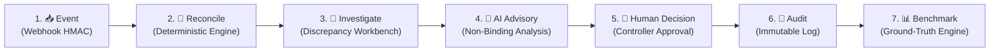

# ReconcileAI — 5-Minute Demonstration Guide & Live Runbook

> **Scope & Grounding Notice**
> **ReconcileAI** is an educational and hackathon submission for the **Razorpay AI Buildathon (Track 04: AI Finance Controller)**.
> All financial data, transactions, internal bank statements, and payment records used in this demonstration are **100% synthetic**. This system is an architectural prototype and educational reference implementation; it does **not** claim a live production Razorpay integration, nor does it connect to real banking networks.

---

## 1. Demo Objective

The core narrative of this presentation:

> *"ReconcileAI demonstrates a complete financial reconciliation loop from transaction ingestion through investigation, human-controlled resolution, auditability, and measurable evaluation."*

In modern digital finance, multi-source discrepancies (gateway vs. bank ledger vs. internal orders) inevitably occur due to network drops, timing lags, and fee deductions. **ReconcileAI** solves this by establishing strict separation of concerns:
1. High-throughput **deterministic rules** resolve clear matches instantly with zero false positives.
2. Unresolved breaks trigger **fuzzy match algorithms** to uncover candidate clusters.
3. An **AI Finance Advisory Agent** performs deep forensic analysis and formulates risk-weighted recommendations.
4. **Human controllers retain 100% final approval and rejection authority**.
5. Every single transition is sealed into an **append-only, immutable audit trail**.

---

## 2. Demo Preparation

### Before You Start

Verify your local environment meets the operational prerequisites before beginning the presentation:

- **Python Runtime**: Python 3.11 or 3.12 active in your virtual environment (`venv` or `conda`).
- **Dependencies**: Installed via `pip install -r requirements.txt`.
- **Environment Configuration**: File `.env` in the repository root (copied from `.env.example`).
  - `DATABASE_URL=sqlite:///./reconcile_ai.db`
  - `WEBHOOK_SECRET=test_secret_key_12345`
  - `GEMINI_API_KEY` (Optional for live Gemini 2.5 Flash LLM calls; if omitted, the backend activates deterministic heuristic advisory fallbacks seamlessly).
- **Network Ports**:
  - Backend API: `http://localhost:8000`
  - Streamlit UI: `http://localhost:8501`

### Service Startup Commands

Open two dedicated terminal tabs:

**Terminal 1 — Backend API Engine (FastAPI / Uvicorn)**:
```bash
python -m uvicorn backend.main:app --reload --port 8000
```

**Terminal 2 — Operations Dashboard (Streamlit)**:
```bash
streamlit run dashboard/app.py
```

*Note: No additional message brokers (Kafka, Redis, Celery) or container engines (Kubernetes) are required. All storage and scheduling operate locally.*

---

## 3. Verify the System Is Running

Before inviting the audience or evaluator to look at your screen, verify system health:

1. **Direct API Verification**:
   Execute `GET http://localhost:8000/health`:
   ```json
   {
     "status": "healthy",
     "database": "connected",
     "gemini_configured": true
   }
   ```
2. **Dashboard UI Indicator**:
   Open `http://localhost:8501`. In the Streamlit sidebar, locate the **System Health** indicator:
   - Green status pill: **API Connected (Port 8000)**.
   - Database indicator: **SQLite Engine Initialized**.
3. **Session Reset (Recommended Pre-Demo Action)**:
   In the sidebar navigation, select **"⚡ 5-Minute Demo"**. Click the top utility button:
   - `🔄 Reset Demo` (`btn_reset_demo_session`)
   This resets the demo state to **Stage 1 (`1. 📥 Event`)** with a clean synthetic scenario.

---

## 4. Five-Minute Demo Flow

The live demonstration flows sequentially through the **seven interactive stages** built into the ReconcileAI Streamlit application:



| Stage | UI Radio Label | Allocated Time | Core Technical Concept |
| :--- | :--- | :--- | :--- |
| **Stage 1** | `1. 📥 Event` | ~45 sec | Cryptographic HMAC SHA-256 Webhook Verification & Idempotency |
| **Stage 2** | `2. 🔄 Reconcile` | ~45 sec | Multi-Source Ingestion & High-Speed Deterministic Matching |
| **Stage 3** | `3. 🔎 Investigate` | ~45 sec | Exception Isolation, SLA Timers, and Escalation Governance |
| **Stage 4** | `4. 🤖 AI Advisory` | ~60 sec | Forensic LLM Investigation & Non-Binding Advisory Bounds |
| **Stage 5** | `5. 👤 Human Decision` | ~45 sec | Governed Human-in-the-Loop Authority (`APPROVED` / `REJECTED`) |
| **Stage 6** | `6. 📜 Audit` | ~30 sec | Append-Only, Tamper-Evident Lifecycle Audit Trail |
| **Stage 7** | `7. 📊 Benchmark` | ~30 sec | 100 Scenarios / 101 Clusters / 289 Raw Txns Baseline |

---

## 5. Stage-by-Stage Runbook

### Stage 1 — Event (`1. 📥 Event`)

- **Duration**: ~45 seconds
- **UI Location**: Select `1. 📥 Event` on the stage radio selector.
- **Controls to Interact With**:
  1. Inspect the pre-filled fields:
     - **Event Type**: `payment.captured`
     - **Transaction Amount (INR)**: `4999.00`
     - **Payment Method**: `UPI`
  2. Examine the generated **JSON Payload** preview and the **HMAC SHA-256 Signature Header**.
  3. Verify the checkbox: `Use Valid HMAC Signature` is checked.
  4. Click button: `🚀 Ingest Webhook Event`.

```
[Presenting Stage 1]
"The first challenge in financial reconciliation is untrusted input. Our webhook
simulator demonstrates a payment.captured event arriving from an external gateway.
Notice that we compute an HMAC-SHA256 signature across the raw binary payload using our
shared secret.

When I click 'Ingest Webhook Event', the backend does not simply parse JSON. It enforces
cryptographic authentication: validating the raw signature, executing an idempotency
check against stored payload hashes, persisting the webhook event, updating the ledger,
and writing an immediate audit record.

If someone tampered with the payload or re-sent the same event ID, FastAPI rejects it
instantly with HTTP 401 Unauthorized or HTTP 409 Conflict. Financial integrity starts
at the network perimeter."
```

- **What the Audience Observes**:
  - Success banner: `HTTP 200 OK — Webhook Ingested Successfully`.
  - Transaction Record created with status `CAPTURED`.
  - Event ID and raw payload digest displayed in the response inspector.
- **Underlying Technical Architecture**:
  - Raw request verification via `hmac.compare_digest`.
  - Replay prevention via unique `event_id` constraint.
  - HTTP Status Codes: `200` (Accepted), `401` (Invalid Signature), `409` (Duplicate Replay), `422` (Validation Error).

---

### Stage 2 — Reconcile (`2. 🔄 Reconcile`)

- **Duration**: ~45 seconds
- **UI Location**: Select `2. 🔄 Reconcile` on the stage radio selector.
- **Controls to Interact With**:
  1. Review the summary of ingestion sources (Internal Orders, Bank Feeds, Gateway Logs).
  2. Click button: `⚡ Run Multi-Source Reconciliation Pipeline`.

```
[Presenting Stage 2]
"Now we advance to multi-source reconciliation. In digital commerce, payments exist across
three separate sources: the internal merchant order system, the payment gateway, and the
bank settlement statement.

When I trigger the reconciliation pipeline, ReconcileAI executes a tiered pipeline:
First, our Deterministic Engine attempts exact 1-to-1 matching on immutable keys—Reference
ID and exact currency amount down to the integer cent. Matches that can be mathematically
proven are resolved instantly as AUTO_RECONCILED with zero probabilistic guesswork.

Any record that fails exact matching—due to timing gaps, fee deductions, or bank reference
truncation—is flagged as a discrepancy and isolated for investigation. Notice that running
this pipeline again is completely idempotent; already-processed candidate clusters safely
return SKIPPED."
```

- **What the Audience Observes**:
  - Execution summary metrics cards:
    - **Clusters Processed**: `101`
    - **Auto-Reconciled**: `75` (or current dataset split)
    - **Exceptions Detected**: `26`
    - **Unresolved Value-at-Risk**: displayed in formatted INR (e.g., `₹142,500.00`).
- **Underlying Technical Architecture**:
  - Strict precedence: Deterministic exact match $\rightarrow$ Candidate match clustering $\rightarrow$ Discrepancy isolation.
  - No probabilistic engine touches exact transactions.
  - Safe replay handling via cluster status checks (`SKIPPED`).

---

### Stage 3 — Investigate (`3. 🔎 Investigate`)

- **Duration**: ~45 seconds
- **UI Location**: Select `3. 🔎 Investigate` on the stage radio selector.
- **Controls to Interact With**:
  1. In the dropdown `Select Exception for Forensic Investigation`, pick an open discrepancy (e.g., `EXC-AMOUNT-MISMATCH` or `EXC-TIMING-LAG`).
  2. Review the structured discrepancy dossier rendered in the workbench.

```
[Presenting Stage 3]
"When an exact match fails, the system must never silently guess or force a ledger
adjustment. It opens a formal Exception record in our Exception Workbench.

Here, we examine Exception EXC-001. Notice the evidence pane: we compare the Gateway
Transaction against the Bank Settlement. The bank received ₹4,900, while the gateway
shows ₹4,999—a ₹99 variance indicating an unrecorded MDR fee deduction.

Furthermore, look at the SLA tracker: the system computes real-time age against our
operational SLA window. Currently, it is marked 'OK (L0)'. If this discrepancy remains
unaddressed, our automated escalation rules trigger L1 and L2 alerts without human
prompting. Even our fuzzy string matching engine serves exclusively as an investigative
aid to highlight potential candidate pairs—it never resolves the exception."
```

- **What the Audience Observes**:
  - Exception dossier detailing: Discrepancy Category (`amount mismatch`, `date mismatch`, `missing bank transaction`), Severity (`MEDIUM`/`HIGH`), Amount Variance (`₹99.00`).
  - SLA Indicator badge: `OK (L0)` / `WARNING (L1)` / `BREACHED (L2)`.
  - Side-by-side evidence comparing Order vs. Gateway vs. Bank data.
- **Underlying Technical Architecture**:
  - Exception entity with life-cycle state `OPEN`.
  - SLA status derived dynamically from `created_at` timestamp.
  - Escalation tiers: `L0` (Primary Reviewer) $\rightarrow$ `L1` (Finance Supervisor) $\rightarrow$ `L2` (Finance Director).

---

### Stage 4 — AI Advisory (`4. 🤖 AI Advisory`)

- **Duration**: ~60 seconds
- **UI Location**: Select `4. 🤖 AI Advisory` on the stage radio selector.
- **Controls to Interact With**:
  1. Point directly to the prominent header: **"AI Advisory Analysis — Non-binding"**.
  2. Review the four structured advisory components:
     - **Recommendation**: `REVIEW` (or `AUTO_RECONCILE` / `ESCALATE` / `EXCEPTION`)
     - **Confidence Score**: `0.88` (88%)
     - **Risk Assessment**: `MEDIUM`
     - **Forensic Reasoning**: Grounded financial breakdown explaining the discrepancy.

```
[Presenting Stage 4]
"Now we introduce our AI Finance Controller Agent, powered by Google Gemini.

I want to direct your attention to the banner at the top of this panel: 'AI Advisory
Analysis — Non-binding'. This is the central architectural principle of ReconcileAI:
AI RECOMMENDS. HUMAN DECIDES.

The AI inspects the full multi-source cluster, identifies that the ₹99 discrepancy matches
standard 2% credit card gateway processing fees plus GST, and recommends 'REVIEW' with 88%
confidence. It generates a clear natural-language explanation and risk breakdown for the
human reviewer.

Crucially: even if the AI recommends 'AUTO_RECONCILE', AI has no authority to approve,
reject, resolve, or mutate financial transaction state. While the AI may persist its advisory
reasoning, analysis results, and audit information, the final financial decision belongs solely
to the authorized human controller. If the external Gemini API is unreachable, our system
immediately activates a deterministic heuristic fallback so operations never stall."
```

- **What the Audience Observes**:
  - Structured advisory card with non-binding disclaimer.
  - Clear taxonomy: Category, Recommendation, Confidence, Risk Level, and Detailed Findings.
  - Clear separation between the advisory output and database state (the exception remains `OPEN`).
- **Underlying Technical Architecture**:
  - Structured output schema (`Pydantic` validated JSON from LLM).
  - Four standardized recommendation outputs: `AUTO_RECONCILE`, `REVIEW`, `ESCALATE`, `EXCEPTION`.
  - Architectural firewall: AI prompt execution has read-only access to transaction context.

---

### Stage 5 — Human Decision (`5. 👤 Human Decision`)

- **Duration**: ~45 seconds
- **UI Location**: Select `5. 👤 Human Decision` on the stage radio selector.
- **Controls to Interact With**:
  1. Enter **Reviewer ID**: `CONTROLLER_DEMO_USER` (already pre-filled).
  2. Enter **Resolution Notes**: `MDR fee schedule verified against merchant contract. Difference of ₹99.00 confirmed as gateway fee.`
  3. Check the mandatory verification box: `[x] I have verified the evidence and authorize this decision`.
  4. Click the decision button: `✅ Approve Exception`.

```
[Presenting Stage 5]
"Here is where human governance is enforced. The exception cannot transition out of the
OPEN state automatically. A designated financial controller must log in, review the AI
advisory report, verify the bank evidence, enter mandatory audit notes, and sign off.

Notice that the 'Approve Exception' button is physically disabled until I check the
verification confirmation box.

I will now approve this exception manually.

Watch the state transition: the backend updates the exception state from OPEN to APPROVED,
locks the record against further modifications, synchronizes the candidate cluster to
MANUAL_APPROVED, and triggers an immutable audit log. Had I selected Reject Exception, the
state would transition from OPEN to REJECTED and the candidate cluster would synchronize
to MANUAL_REJECTED. If another user attempts to submit a conflicting decision now, the backend
rejects it with HTTP 400 Bad Request. Conflicting human decisions are impossible."
```

- **What the Audience Observes**:
  - Success banner: `Exception EXC-001 successfully APPROVED by CONTROLLER_DEMO_USER`.
  - State change: `Status: APPROVED`.
  - Form fields become locked / disabled for this exception.
- **Underlying Technical Architecture**:
  - State transitions:
    - Human APPROVE: Exception $\rightarrow$ `APPROVED`, ReconciliationResult $\rightarrow$ `MANUAL_APPROVED`.
    - Human REJECT: Exception $\rightarrow$ `REJECTED`, ReconciliationResult $\rightarrow$ `MANUAL_REJECTED`.
  - Lifecycle states: `OPEN` $\rightarrow$ `APPROVED` or `OPEN` $\rightarrow$ `REJECTED`.
  - Concurrency & idempotency: Repeated identical requests return `200` with existing state; contradictory requests return `400 Conflict`.

---

### Stage 6 — Audit (`6. 📜 Audit`)

- **Duration**: ~30 seconds
- **UI Location**: Select `6. 📜 Audit` on the stage radio selector.
- **Controls to Interact With**:
  1. Scroll through the interactive **Audit Trail Ledger** table.
  2. Highlight the most recent entry at the top of the table.

```
[Presenting Stage 6]
"Immediately following the human decision, we inspect the Audit Trail.

Look at the top row of the ledger:
Action: EXCEPTION_APPROVED
Entity: Exception (EXC-001)
Actor: CONTROLLER_DEMO_USER
Old Value: OPEN
New Value: APPROVED
Reason: MDR fee schedule verified against merchant contract.

Every state transition across the entire platform is written through our AuditService into
an append-only, tamper-evident SQLite table. SQLAlchemy ORM event listeners block all
UPDATE and DELETE statements against the audit table at the database driver level.

In enterprise finance, you must prove five things for regulatory compliance: what happened,
when it happened, who authorized it, what values changed, and why. ReconcileAI guarantees
all five."
```

- **What the Audience Observes**:
  - Audit log table with columns: `Timestamp`, `Actor`, `Action`, `Entity Type`, `Entity ID`, `Old State`, `New State`, `Reason`.
  - Clear entry capturing the human approval executed seconds earlier.
- **Underlying Technical Architecture**:
  - `AuditLog` table with append-only integrity guards.
  - Append-only audit behavior is enforced through SQLAlchemy ORM protections using `before_update`, `before_delete`, and `Session.do_orm_execute`, which raise `AuditLogImmutableError` when prohibited modifications are attempted.
  - Complete compliance breadcrumb for SOX / regulatory audits.

---

### Stage 7 — Benchmark (`7. 📊 Benchmark`)

- **Duration**: ~30 seconds
- **UI Location**: Select `7. 📊 Benchmark` on the stage radio selector.
- **Controls to Interact With**:
  1. Click button: `⚡ Run Ground-Truth Benchmark`.
  2. Present the evaluation metrics displayed across the dashboard.

```
[Presenting Stage 7]
"Finally, we don't just demonstrate a single happy-path transaction. We measure the
system using an empirical ground-truth evaluation suite.

When I run the benchmark, ReconcileAI executes against our fixed evaluation population:
- Exactly 100 Ground-Truth Scenarios
- Exactly 101 Candidate Match Clusters
- Exactly 289 Raw Source Transactions

Notice our results:
- Classification Accuracy: 100.0%
- Precision on Matches: 100.0% — meaning ZERO false positives. We never falsely match
  unrelated money.
- Match Recall: 100.0%
- Deterministic Auto-Reconciliation Rate: 57.43%
- Human-Review Routing Rate: 42.57%

A key technical note for judges: in our original Phase 13 benchmark, Fuzzy-Assisted and
AI-Assisted rates are recorded as 0.0%. This is because that baseline benchmark was
specifically designed to measure the standalone deterministic matching engine in isolation.
Fuzzy clustering and AI advisory reasoning were added as layered forensic stages for
unresolved exceptions in subsequent phases."
```

- **What the Audience Observes**:
  - Benchmark summary cards:
    - **Scenarios Evaluated**: `100 Ground-Truth Scenarios`
    - **Candidate Clusters**: `101 Candidate Clusters`
    - **Raw Transactions**: `289 Raw Transactions`
    - **Match Precision**: `100.0%`
    - **Classification Accuracy**: `100.0%`
    - **Match Recall**: `100.0%`
    - **Deterministic Auto-Reconciliation Rate**: `57.43%`
    - **Human-Review Routing Rate**: `42.57%`
    - **Throughput**: `> 1,500 txns/sec`
- **Underlying Technical Architecture**:
  - Rigorous offline test dataset with known ground truth across 9 discrepancy categories.
  - Clear mathematical separation between scenario count (100), operational clusters (101), and raw transactions (289).

---

## 6. Demo Talking Points

Keep these concise, student-friendly one-liners ready during presentation transitions:

- **The Problem**:
  *"Payments exist across disconnected systems, so one transaction has different references, amounts, and settlement timestamps."*
- **Deterministic First**:
  *"We always run deterministic rules first because financial transactions that can be mathematically verified should never depend on probabilistic reasoning."*
- **Role of Fuzzy Matching**:
  *"Fuzzy string matching does not decide financial truth; it provides investigative evidence when gateway references are slightly truncated or malformed."*
- **Role of AI**:
  *"The AI agent is a forensic investigator, not an accountant. It analyzes evidence, detects patterns like fee deductions, and provides an advisory recommendation."*
- **Role of the Human**:
  *"The final exception decision belongs exclusively to an authorized human controller with mandatory notes and verification."*
- **Auditability**:
  *"Every financial event and decision is permanently recorded in an append-only audit trail that cannot be updated or deleted."*
- **Evaluation**:
  *"We prove system performance using an empirical 100-scenario ground-truth benchmark rather than showing cherry-picked examples."*

---

## 7. What This Demo Proves

When you complete the presentation, the judge or reviewer has observed concrete proof of **ten engineering capabilities**:

1. **Multi-Source Financial Reconciliation**: Ingestion and alignment across merchant orders, gateway logs, and bank statements.
2. **Deterministic Exact Matching**: Strict 1-to-1 match algorithms achieving 100% precision with zero false matches.
3. **Fuzzy Forensic Investigation**: Levenshtein-distance evidence scoring without unguided auto-resolution.
4. **AI-Assisted Reasoning**: Structured, risk-scored insights powered by Gemini with deterministic heuristic fallbacks.
5. **Human-Controlled Resolution**: Role-governed approval/rejection workflows with mandatory verification.
6. **SLA & Escalation Governance**: Dynamic breach calculation (`OK`, `WARNING`, `BREACHED`) with multi-tier escalation (`L0`–`L2`).
7. **Webhook Security & Idempotency**: Cryptographic HMAC-SHA256 verification and replay rejection.
8. **Immutable Auditability**: Append-only audit logging with ORM-level update/delete blocks.
9. **Architectural Separation**: Clean decoupling between FastAPI backend services and the Streamlit frontend client via HTTP.
10. **Empirical Evaluation**: Rigorous benchmarking across 100 ground-truth scenarios, 101 candidate clusters, and 289 raw transactions.

---

## 8. The Most Important Safety Point

Make this moment the centerpiece of your presentation:

```
=======================================================================
                     AI RECOMMENDS. HUMAN DECIDES.
=======================================================================
```

- **Advisory Only**: AI recommendations (`AUTO_RECONCILE`, `REVIEW`, `ESCALATE`, `EXCEPTION`) are non-binding.
- **Advisory Authority Bounds**: AI has no authority to approve, reject, resolve, or mutate financial transaction state. While the AI may persist its advisory reasoning, analysis results, and audit information, it cannot make the final financial decision or change financial balances.
- **Guaranteed Human Gate**: An exception can only transition to `APPROVED` or `REJECTED` via an explicit, authenticated human controller action.
- **Tamper Resistance**: Audit logs cannot be modified or purged through normal application operations.
- **Fail-Safe Fallbacks**: If external AI APIs fail or time out, the system degrades gracefully to deterministic heuristic analysis.

---

## 9. If Something Goes Wrong (Troubleshooting & Recovery)

| Issue Encountered | Likely Cause | Exact Recovery Procedure |
| :--- | :--- | :--- |
| **Backend unavailable / Connection Refused** | Uvicorn server is not running on port 8000. | Check Terminal 1. Restart: `python -m uvicorn backend.main:app --reload --port 8000`. |
| **Dashboard cannot connect** | Wrong API URL configured in Streamlit. | Ensure sidebar setting is `http://localhost:8000`. Check `GET /health` in browser. |
| **Webhook returns 401 Unauthorized** | Signature mismatch or altered secret. | In Stage 1, ensure `Use Valid HMAC Signature` checkbox is enabled. |
| **Webhook returns 409 Conflict** | Replay prevention triggered by identical `event_id`. | Explain replay prevention to the judge! Then check `Generate New Event ID` and resubmit. |
| **Reconciliation returns `SKIPPED`** | Candidate clusters were already reconciled in a previous run. | Explain idempotency! If a fresh run is needed, click `🔄 Reset Demo` at the top of the demo view. |
| **No exceptions appear in Workbench** | Selected scenario has 100% exact matches. | Click `🔄 Reset Demo` to reload the standard multi-source discrepancy scenario. |
| **Gemini AI call times out / fails** | Missing `GEMINI_API_KEY` or network restriction. | The system automatically activates the heuristic advisory fallback. Point out that the system never crashes when cloud AI is down. |
| **Benchmark shows 0% Fuzzy/AI rate** | Natural design of the Phase 13 deterministic baseline. | Clarify to the judge that Phase 13 specifically measured the deterministic engine baseline before layered AI stages were added. |

*Safety Reminder: Never manually edit or delete database rows using an external SQLite GUI during a live demo.*

---

## 10. What Not to Do

Avoid these critical demo mistakes:

- **NEVER claim AI autonomously approves or resolves financial exceptions.** (It is strictly advisory).
- **NEVER claim this is a production-ready Razorpay integration.** (It is an educational Buildathon submission with synthetic data).
- **NEVER expose API keys or webhook secrets** on screen or in presentation slides.
- **NEVER bypass the human decision screen** to claim automated straight-through exception closing.
- **NEVER claim the audit trail uses "blockchain" or database triggers.** (It uses an append-only relational table protected by SQLAlchemy ORM event interceptors).
- **NEVER claim the system uses Kafka, Redis, Celery, or Kubernetes.** (It uses clean, lightweight Python multiprocessing and SQLite).
- **NEVER manually edit the database file (`reconcile_ai.db`)** during the live presentation.
- **NEVER claim the benchmark represents millions of live transactions.** (Cite the exact denominators: 100 scenarios, 101 clusters, 289 transactions).

---

## 11. If You Only Have 2 Minutes (Lightning Demo)

If the judges instruct you to keep your presentation under two minutes, follow this compressed sequence:

1. **Dashboard & Webhook (30s)**:
   Show the Streamlit dashboard on `1. 📥 Event`. Ingest a webhook with valid HMAC SHA-256 to show tamper prevention.
2. **Reconciliation & Discrepancy (30s)**:
   Switch to `2. 🔄 Reconcile`. Click `⚡ Run Multi-Source Reconciliation Pipeline`. Show that exact matches auto-reconcile, while a ₹99 fee mismatch opens an exception.
3. **AI Advisory & Human Decision (40s)**:
   Switch to `4. 🤖 AI Advisory` $\rightarrow$ highlight *"AI Recommends. Human Decides."* Then switch to `5. 👤 Human Decision`, check the authorization box, and click `✅ Approve Exception`.
4. **Audit & Benchmark (20s)**:
   Switch to `6. 📜 Audit` to show the immutable `EXCEPTION_APPROVED` log, then switch to `7. 📊 Benchmark` to cite **100% precision (zero false positives)** across 100 ground-truth scenarios.

---

## 12. If the Judge Asks: "How Does That Work?" (Technical Q&A)

### Q1: Why do you run deterministic reconciliation before AI?
> *"Financial transactions that match exactly on unique IDs and currency cents can be mathematically proven. Running deterministic matching first ensures 100% precision, zero false positives, and microsecond throughput, reserving AI computation exclusively for genuine discrepancies."*

### Q2: Why include fuzzy matching if it doesn't auto-resolve?
> *"In real-world finance, bank settlement strings often truncate merchant order IDs or introduce minor typographical differences. Fuzzy matching calculates string similarity to surface candidate pairs for human investigation, but it is strictly forbidden from executing unguided balance changes."*

### Q3: Why not let the AI approve simple exceptions automatically?
> *"In financial systems, automated AI write-authority creates catastrophic risk of hallucinated balance mutations and non-compliance with accounting regulations. Our architecture enforces 'AI Recommends, Human Decides' to keep humans legally and operationally accountable."*

### Q4: How is webhook authenticity verified?
> *"The backend takes the raw HTTP request body and computes a cryptographic HMAC SHA-256 digest using a pre-shared secret key. It compares the computed digest with the `X-Razorpay-Signature` header using timing-attack-safe string comparison (`hmac.compare_digest`)."*

### Q5: How do you prevent webhook replay attacks?
> *"Every incoming webhook contains a unique `event_id`. The backend checks the database for existing event IDs. If a duplicate arrives, the system aborts processing immediately and responds with HTTP 409 Conflict."*

### Q6: How is audit trail immutability enforced?
> *"The `AuditLog` table is strictly append-only. We register SQLAlchemy ORM event listeners (`before_update`, `before_delete`) that intercept any attempt to modify or delete audit rows and immediately raise fatal exceptions."*

### Q7: Why require a human in the loop?
> *"Reconciliation discrepancies often represent real-world disputes—such as unannounced bank fee increases, partial chargebacks, or network drops. Resolving them requires contextual business authority that an algorithmic model cannot legally assume."*

### Q8: How is SLA status calculated?
> *"Each exception records its creation timestamp. The SLA engine measures elapsed operational time against percentage thresholds of the severity duration: `<75%` is `OK`, `75%–<100%` is `WARNING`, and `≥100%` is `BREACHED`. The configured prototype durations are `CRITICAL` (1 hour), `HIGH` (4 hours), `MEDIUM` (24 hours), and `LOW` (48 hours)—noting that these are project defaults, not Razorpay production requirements."*

### Q9: How does escalation governance work?
> *"When SLA thresholds are breached, the escalation engine updates the exception's escalation level from `L0` (Primary Reviewer) to `L1` (Finance Supervisor) and `L2` (Finance Director). It generates notification records and audit logs without mutating the underlying financial data."*

### Q10: Why does the benchmark evaluate 100 scenarios, 101 clusters, and 289 transactions?
> *"The evaluation dataset consists of 100 rigorously curated ground-truth test scenarios spanning 9 distinct discrepancy categories. When ingested into the matching engine, they assemble into 101 candidate match clusters comprising 289 raw source records from orders, gateway logs, and bank statements."*

### Q11: Why did the original benchmark report 0% fuzzy and 0% AI assistance?
> *"The Phase 13 benchmark was purposefully isolated to evaluate the baseline performance of the deterministic engine alone. Fuzzy matching and AI advisory capabilities operate downstream as investigative layers for unresolved exceptions in the complete FinanceController pipeline."*

### Q12: How are automated tests kept isolated from production data?
> *"Our test suite uses hermetic fixtures in `tests/conftest.py` that spin up a temporary, isolated SQLite test database for each test run. The persistent development database (`reconcile_ai.db`) is never touched during test execution."*

### Q13: Why does Streamlit communicate via HTTP instead of querying SQLite directly?
> *"Direct database querying from the UI violates enterprise architecture by coupling UI code to database schemas and bypassing security controls. Communicating exclusively via HTTP REST endpoints ensures all actions undergo authentication, validation, idempotency checks, and audit logging."*

---

## 13. How to Close the Demo

Use this clean, confident closing statement:

> *"To summarize: ReconcileAI proves that AI in financial operations is most powerful when paired with strict governance. We use deterministic algorithms for speed and 100% precision, fuzzy matching for evidence discovery, Gemini AI for deep forensic analysis, and human controllers for absolute decision authority—all sealed by an immutable audit trail. Thank you, and I am happy to answer any questions."*

---

## 14. Pre-Demo Checklist

Run through this checklist 5 minutes before your presentation:

- [ ] **Backend Service Running**: Uvicorn running in Terminal 1 on port `8000`.
- [ ] **Dashboard Service Running**: Streamlit running in Terminal 2 on port `8501`.
- [ ] **Health Endpoint Verified**: `http://localhost:8000/health` returns status `"healthy"`.
- [ ] **Environment Loaded**: `.env` contains valid `DATABASE_URL` and `WEBHOOK_SECRET`.
- [ ] **Synthetic Data Verified**: Synthetic scenarios ready in database.
- [ ] **Webhook Simulator Tested**: Stage 1 loads cleanly with `payment.captured`.
- [ ] **Valid Signature Box Checked**: `Use Valid HMAC Signature` is selected.
- [ ] **AI Advisory Inspected**: Non-binding banner is visible on Stage 4.
- [ ] **Ground-Truth Benchmark Ready**: Stage 7 loads the 100/101/289 metric cards.
- [ ] **No Secrets on Screen**: Code editors and terminal windows hiding API keys.
- [ ] **Browser Window Sized**: Browser zoomed to 100% on `http://localhost:8501`.
- [ ] **Seven Stages Followed**: Presentation strictly follows the 1 $\rightarrow$ 7 progression.
