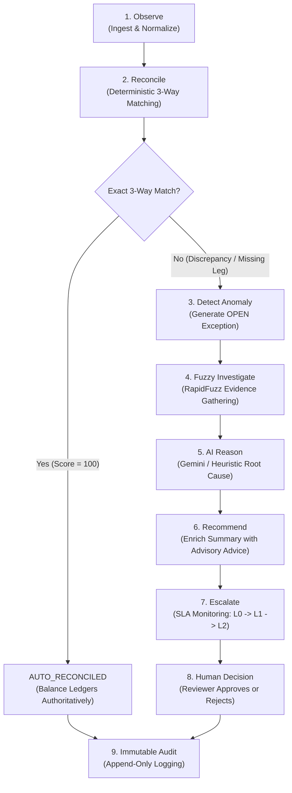
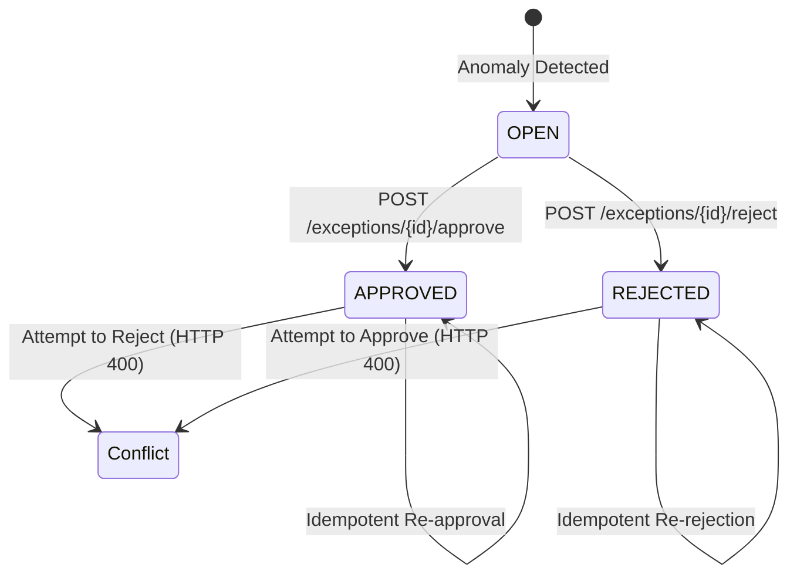

# ReconcileAI — Student Technical Learning Guide

Welcome to the **ReconcileAI Technical Learning Guide**.

This guide is designed for student developers, buildathon judges, and software engineers who want to understand not just *what* code exists in ReconcileAI, but *why* it was designed this way, *how* modern financial software handles multi-source transactions, and *how to articulate* these concepts with technical precision in an engineering interview.

---

## 1. The Big Picture: What Problem Does ReconcileAI Solve?

### The Multi-Source Financial Reality
In modern e-commerce and fintech, a single consumer payment does not exist in a single database. Instead, it leaves digital footprints across **three distinct, asynchronous platforms**:

```
┌─────────────────────────┐      ┌─────────────────────────┐      ┌─────────────────────────┐
│  1. Payment Gateway     │      │  2. Banking Partner     │      │  3. Internal ERP / GL   │
│     (e.g., Razorpay)    │      │     (Settlement Bank)   │      │     (Order & Billing)   │
├─────────────────────────┤      ├─────────────────────────┤      ├─────────────────────────┤
│ • Captured payment      │      │ • Batch net settlement  │      │ • Sales order invoice   │
│ • Gateway fee & GST     │      │ • Bank statement UTR    │      │ • Merchant ledger entry │
│ • Webhook event log     │      │ • Bank nodal fee debits │      │ • Accounts receivable   │
└─────────────────────────┘      └─────────────────────────┘      └─────────────────────────┘
```

These three systems operate on different timelines, formats, and network connections:
- The **Payment Gateway** authorizes and captures customer payments in real time and records processing fees.
- The **Bank** credits settled funds to the merchant nodal account hours or days later (often in aggregated batches with UTR reference numbers).
- The **ERP / Accounting Ledger** generates billing invoices and order tracking records when the customer checks out.

### Why Do Discrepancies Happen?
Because these platforms are asynchronous and decoupled, financial discrepancies inevitably arise:
1. **Timing Delays**: A payment captured on Friday night may not settle in the bank statement until Monday morning.
2. **Fee Variance**: Gateway surcharges or payment method fees (UPI vs. Credit Card vs. Netbanking) can cause the net amount credited by the bank to differ from the gross order invoice.
3. **Dropped Webhooks / Network Retries**: Intermittent packet drops can cause an ERP to miss a gateway event, leaving an invoice marked as "Pending" while money has already been deducted.
4. **Human / Operational Errors**: Manual bank transfers or ledger journal corrections can carry typographical errors in reference numbers.

### The ReconcileAI Solution
**ReconcileAI** is an intelligent, multi-source financial reconciliation and exception-governance platform. It ingests records from all three sources, normalizes them into a canonical model, applies authoritative deterministic matching rules, uses fuzzy string similarity (RapidFuzz) to uncover hidden linkages, leverages structured AI advisory reasoning (Gemini / Heuristic Fallback) to diagnose root causes, enforces operational SLA escalation, and empowers human reviewers to make authoritative decisions—all backed by a strictly immutable audit trail.

> [!IMPORTANT]
> **Educational & Buildathon Notice:**
> ReconcileAI is a buildathon reference prototype developed for **Track 04: AI Finance Controller** in the **Razorpay AI Buildathon**. All financial transactions, bank accounts, customer IDs, and webhook events run on **100% synthetic financial data**. The system operates locally and does not interface with live banking networks or production merchant credentials.

---

## 2. The End-to-End Financial Lifecycle

Every transaction set in ReconcileAI traverses a disciplined **nine-stage lifecycle**:



### A Running Example: Clean Match vs. Discrepancy

#### Scenario A: The Clean Match (Deterministic Fast-Path)
* **Gateway**: Order `ORD_101`, Reference `pay_101`, Amount `₹10,000.00`, Status `CAPTURED`.
* **Bank**: Reference `pay_101`, Credit Amount `₹10,000.00`, Status `CREDIT`.
* **ERP**: Order `ORD_101`, Reference `pay_101`, Expected `₹10,000.00`, Status `PAID`.

**What Happens?**
`DeterministicReconciliationEngine` clusters these three transactions by `order_id` and `reference_id`. All amounts match within zero tolerance (`AMOUNT_TOLERANCE_INR = 0.00`). All three legs exist. The engine immediately assigns `AUTO_RECONCILED` with `match_score = 100.0` and `discrepancy_amount = 0.00`.
*Result*: Ledgers balance automatically with mathematical certainty. No AI call or human intervention is required.

---

#### Scenario B: The Discrepancy (Investigation & Human Governance)
* **Gateway**: Order `ORD_102`, Reference `pay_102`, Amount `₹10,000.00`, Fee `₹150.00`.
* **Bank**: Reference `pay_102`, Credit Amount `₹9,850.00` (Net of fee).
* **ERP**: Order `ORD_102`, Gross Invoice `₹10,000.00`.

**What Happens?**
1. **Deterministic Check**: The bank leg reflects `₹9,850.00` while the ERP expects `₹10,000.00`. Amount variance = `₹150.00`.
2. **Anomaly Detected**: An exception (`category = "AMOUNT_MISMATCH"`, `severity = "HIGH"`, `difference_amount = 150.00`) is staged in state `OPEN`.
3. **Fuzzy Investigation**: `FuzzyMatchEngine` checks reference strings and merchant descriptions across unlinked bank candidates to verify whether an additional credit leg exists.
4. **AI Reasoning**: The AI controller reviews the `₹150.00` delta against gateway fee metadata (`fee: 150.00`), recognizing that `₹10,000 - ₹150 = ₹9,850`. It outputs:
   - `ai_recommendation: "REVIEW"`
   - `confidence: 0.95`
   - `ai_explanation: "Discrepancy corresponds exactly to gateway MDR processing fee (₹150.00). Recommend booking MDR fee expense in ERP and approving net settlement."`
5. **Operational SLA**: The exception enters the queue with a 4-hour SLA deadline (`HIGH` severity). If unattended, it escalates from L0 to L1.
6. **Human Decision**: A human finance operator reviews the AI's explanation and verified fee schedule, clicking **Approve** in the dashboard.
7. **Audit Trail**: The approval is immutably logged with the reviewer's ID, timestamp, and notes.

---

## 3. What is Three-Way Reconciliation?

In accounting, **reconciliation** is the process of verifying that two or more sets of records agree. **Three-Way Reconciliation** specifically validates that the **Payment Gateway**, the **Settlement Bank**, and the **Internal Accounting Ledger (ERP)** tell an identical financial story.

```
                  ┌────────────────────────┐
                  │ 1. Gateway Transaction │
                  └───────────┬────────────┘
                              │
                    Does Amount & Ref Match?
                              │
         ┌────────────────────┴────────────────────┐
         ▼                                         ▼
┌─────────────────┐                       ┌─────────────────┐
│  2. Bank Credit │◄─── Do Ledgers Agree? ──►│  3. ERP Invoice │
└─────────────────┘                       └─────────────────┘
```

### Verified Reconciliation Scenario Categories in ReconcileAI

ReconcileAI systematically generates and evaluates 9 verified scenario categories across its ground-truth benchmark:

| Scenario Category | Description | Root Cause / Manifestation |
| :--- | :--- | :--- |
| **`EXACT_MATCH`** (Exact Match) | All three legs (Gateway, Bank, ERP) exist with identical amounts and matching references. | Clean transaction; auto-reconciles deterministically without manual review. |
| **`AMOUNT_MISMATCH`** (Amount Mismatch) | Gateway and ERP show ₹5,000, but Bank shows ₹4,800. | Undocumented fee deduction, processing surcharge, or currency rounding variance. |
| **`MISSING_BANK_TRANSACTION`** (Missing Bank) | Gateway captured payment and ERP billed customer, but Bank statement has no credit deposit. | Settlement batch in transit, nodal bank clearing hold, or gateway payout failure. |
| **`MISSING_GATEWAY_TRANSACTION`** (Missing Gateway) | Bank reflects customer credit, but Gateway has no captured transaction record. | Direct customer bank transfer (NEFT/IMPS/RTGS) bypassing the payment gateway. |
| **`DUPLICATE_TRANSACTION`** (Duplicate) | Customer debited twice for a single ERP order ID, or repeated gateway capture. | Network retry timeout or customer double-submitting checkout. |
| **`DATE_MISMATCH`** (Date Mismatch) | Bank value date exceeds the allowable settlement date tolerance window relative to capture date. | Banking holidays, weekend batch processing delays, or extended risk review holds. |
| **`REFERENCE_MISMATCH`** (Reference Mismatch) | Bank settlement narration contains typos, truncated references, or legacy UTR formats. | Formatting mismatch between gateway payment ID and bank settlement narration. |
| **`PARTIAL_PAYMENT`** (Partial) | Bank credit amount represents an instalment or split settlement of total expected invoice amount. | Multi-stage settlement or milestone customer payment. |
| **`FAILED_PAYMENT`** (Failed) | Gateway records a dropped or failed payment attempt without completed settlement. | Card network rejection, insufficient funds, or customer cancellation at 3DS OTP step. |

*(Note: While general financial systems encounter other anomalies such as complex tax reconciliations or foreign exchange adjustments, the above 9 categories represent the exact ground-truth scenarios verified by ReconcileAI's automated evaluation harness).*

> [!TIP]
> **Key Interview Takeaway:**
> *"Reconciliation is far more than checking `if amount_a == amount_b`. It is multi-dimensional clustering across time windows, transaction states, fee deductions, and reference identifiers."*

---

## 4. Synthetic Data & Ground Truth: The Evaluation Anchor

### Why Synthetic Data?
Financial engineering requires rigorous testing against rare and catastrophic edge cases: gateway outages, partial chargebacks, and corrupted references. Using production data poses severe privacy, regulatory, and security risks.

ReconcileAI uses a deterministic generator (`scripts/generate_synthetic_data.py`) to manufacture realistic Indian e-commerce scenarios with known ground-truth labels.

### The Three Population Denominators
In machine learning and financial systems, reporting a percentage without stating the **exact denominator** is a critical flaw. ReconcileAI strictly separates three distinct populations:

```
┌────────────────────────────────────────────────────────────────────────┐
│ 1. 100 Ground-Truth Scenarios                                          │
│    Denominator for Classification Correctness:                         │
│    Accuracy (100%), Precision (1.0), Recall (1.0), F1-Score (1.0)      │
├────────────────────────────────────────────────────────────────────────┤
│ 2. 101 Candidate Match Clusters                                        │
│    Denominator for Operational Routing:                                │
│    Auto-Reconciliation Rate (57.43%), Review Routing Rate (42.57%)     │
├────────────────────────────────────────────────────────────────────────┤
│ 3. 289 Raw Source Transactions                                         │
│    Denominator for Throughput & Turnover Volume:                       │
│    Throughput (~6,400+ txns/sec), Total Financial Value (₹24,06,960.00)│
└────────────────────────────────────────────────────────────────────────┘
```

1. **100 Ground-Truth Scenarios**: 58 clean matches and 42 injected discrepancy scenarios. Used exclusively to compute true positives, false positives, precision, and recall.
2. **101 Candidate Match Clusters**: When the clustering algorithm evaluates the 289 raw transactions, an unmatched orphan transaction forms its own cluster, producing 101 clusters. 58 clusters auto-reconcile cleanly ($57.43\%$), and 43 clusters route to human exception review ($42.57\%$).
3. **289 Raw Source Transactions**: 100 Gateway + 95 Bank + 94 ERP records. Used to measure end-to-end processing throughput and total turnover.

---

## 5. Data Normalization: Speaking a Single Language

Every financial institution formats records differently:
* Razorpay webhooks send ISO 8601 timestamps and decimal amounts in JSON.
* Bank statements provide dates as `DD/MM/YYYY`, with debits and credits in separate columns.
* ERP systems export uppercase column headers with localized currency strings like `"INR 10,000.00"`.

```
Raw Gateway Webhook ──┐
Raw Bank CSV         ──┼──► [Normalizer Service] ──► CanonicalTransaction
Raw ERP Ledger CSV   ──┘
```

The `Normalizer` service (`backend/services/normalizer.py`) sanitizes every raw record into a unified `CanonicalTransaction` Pydantic model:
* Amounts are parsed into standard non-negative floats.
* Dates are normalized into UTC timezone-aware `datetime` objects.
* Currencies are converted to standard 3-letter ISO uppercase codes (`"INR"`).
* Text fields are stripped of leading/trailing whitespace and control characters.

---

## 6. Deterministic Reconciliation: Rules Before Probabilities

### Why Deterministic Logic Comes First
In financial accounting, **probabilistic guesses cannot balance a general ledger**. If two records match on Order ID, Reference ID, Currency, and Amount within exact zero tolerance, mathematical certainty exists.

ReconcileAI executes `DeterministicReconciliationEngine` (`backend/services/reconciliation.py`) as **Stage 1**:
1. Groups canonical transactions into clusters sharing common `order_id` or `reference_id` identifiers.
2. Checks whether all three legs (`GATEWAY`, `BANK`, `ERP`) are present.
3. Tests amounts against strict zero-tolerance (`AMOUNT_TOLERANCE_INR = 0.00`).
4. Tests date intervals against allowed clearing windows (`DATE_TOLERANCE_DAYS = 3`).

### Important Technical Truth
> [!IMPORTANT]
> **`AUTO_RECONCILED` is produced exclusively by the Deterministic Engine.**
> The AI controller does **not** auto-reconcile transactions. Exact matches are resolved deterministically, freeing human operators and LLMs to focus solely on complex discrepancies.

---

## 7. Fuzzy Matching & Investigation: RapidFuzz Evidence

### What is Fuzzy Matching?
When references contain minor typos (e.g., Bank narrative says `"RZP*PAY*1001"` while Gateway has `"pay_1001"`), exact deterministic string equality (`==`) fails.

Instead of guessing, ReconcileAI engages `FuzzyMatchEngine` (`backend/services/fuzzy_matcher.py`) powered by **RapidFuzz**:
* **Token Sort Ratio**: Reorders words alphabetically before comparing, handling rearranged text.
* **Partial Ratio**: Identifies sub-string matches within messy bank narration strings.

```
Gateway Ref:  "pay_9001"
Bank Narration: "CMS/REV/PAY9001/MUMBAI/CITI"
RapidFuzz Partial Ratio: 92.3%  ──► HIGH SIMILARITY EVIDENCE
```

### Scoring Thresholds
* **$\ge 85.0$ Composite Score**: High-confidence fuzzy link. Flagged as strong correlation evidence.
* **$70.0 - 84.9$ Composite Score**: Moderate correlation. Flagged for human review.
* **$< 70.0$ Composite Score**: Weak correlation. Rejected as a match.

### Investigative Evidence, Not Financial Settlement
> [!WARNING]
> **Fuzzy matching produces evidence, NOT financial settlements.**
> A high similarity score ($95\%$) is staged as an investigative clue for the AI and human reviewer. It **never** mutates database ledger balances autonomously.

---

## 8. AI Finance Controller: Contextual Advisory Reasoning

When a discrepancy occurs, human operators often spend 15–30 minutes correlating gateway fee schedules, bank chargeback codes, and customer invoices to determine what went wrong.

The `AIController` (`backend/services/ai_controller.py`) acts as an **expert financial copilot**:
1. Ingests the deterministic failure signals (e.g., delta = ₹150.00).
2. Ingests RapidFuzz similarity evidence.
3. Prompts Google Gemini (or an offline deterministic heuristic fallback).
4. Generates a strongly typed, structured Pydantic response:
   - `ai_recommendation`: One of `AUTO_RECONCILE`, `REVIEW`, `ESCALATE`, `EXCEPTION`.
   - `ai_confidence`: Float between `0.0` and `1.0`.
   - `risk_level`: `LOW`, `MEDIUM`, or `HIGH`.
   - `ai_reasoning`: Plain-English explanation of the underlying accounting discrepancy.
   - `suggested_action`: Prescriptive remediation step (e.g., `"INVESTIGATE_FEE_STRUCTURE"`).

---

## 9. Core Architectural Invariant: AI is Advisory, NOT Final Authority

```
┌────────────────────────────────────────────────────────┐
│               THE FINANCIAL SAFETY PRINCIPLE           │
│                                                        │
│           AI Recommends.  Human Decides.               │
└────────────────────────────────────────────────────────┘
```

In an enterprise fintech architecture, allowing an LLM to directly approve financial variances or alter ledger entries introduces unacceptable hallucinations and regulatory risks.

In ReconcileAI:
* The AI **cannot** set `is_resolved = True`.
* The AI **cannot** change an exception's status from `OPEN` to `APPROVED` or `REJECTED`.
* The AI **cannot** modify transaction monetary amounts or currency codes.
* The AI outputs advice; the human reviewer retains **exclusive authority** to settle discrepancies.

---

## 10. Human-in-the-Loop Financial Governance

When an anomaly is flagged, it enters the **Exception Management Service** (`backend/services/exception_service.py`):

```
OPEN Exception
      │
      ├─► Reviewer examines Gateway, Bank, and ERP legs
      ├─► Reviewer inspects RapidFuzz similarity evidence
      ├─► Reviewer evaluates AI advisory explanation
      │
      ▼
Authoritative Decision (POST /exceptions/{id}/approve OR /reject)
      │
      ├── Reviewer ID recorded (e.g., "REV_PRIYA_SHARMA")
      ├── Mandatory rationale notes captured
      ├── ReconciliationResult synchronized (is_resolved = True)
      └── Immutable AuditLog entry committed atomically
```

### Governance Guardrails
1. **Mandatory Identity**: Approvals and rejections strictly mandate a non-empty `reviewer_id`.
2. **Conflict Prevention**: If Reviewer A approves an exception, Reviewer B cannot overwrite it with a rejection (returns `HTTP 400 Bad Request`).
3. **Decision Idempotency**: If the same reviewer re-approves an exception, the system returns the existing record safely without generating duplicate logs.

---

## 11. Webhooks & Real-Time Payment Event Processing

Payment gateways communicate transaction updates through **HTTP Webhooks**:
* `payment.authorized`: Customer funds blocked at issuing bank.
* `payment.captured`: Merchant successfully claims authorized funds.
* `payment.failed`: Transaction rejected by bank or card network.
* `refund.created`: Funds returned to customer account.

The ReconcileAI webhook endpoint (`POST /webhook/payment`) acts as an ingress simulator, transforming real-time payment gateway events into canonical `Transaction` records and staging them for the next reconciliation cycle.

---

## 12. Webhook Security: HMAC SHA-256 Signatures

### The Threat
Without authentication, any malicious actor on the internet could send an HTTP POST to `/webhook/payment` claiming:
`{"amount": 1000000, "status": "captured"}`.

### The Defense: HMAC SHA-256
ReconcileAI enforces cryptographic signature verification:
1. The gateway calculates an HMAC SHA-256 hash of the **raw request body bytes** using a shared secret key.
2. The gateway sends this signature in the `X-Razorpay-Signature` HTTP header.
3. The ReconcileAI backend recalculates the hash over `await request.body()`.
4. Signatures are compared using Python's `hmac.compare_digest()`:

```python
computed_signature = hmac.new(secret_bytes, raw_body_bytes, hashlib.sha256).hexdigest()
is_valid = hmac.compare_digest(computed_signature.lower(), received_signature.lower())
```

### Why Raw Body Bytes Matter
Parsing JSON into a Python dictionary and re-serializing it changes whitespace, key ordering, and character escapes. Calculating the HMAC over parsed JSON causes hash mismatches. Verifying against the **exact raw byte stream** guarantees mathematical integrity.

### Why Constant-Time Comparison Matters
Standard string equality (`==`) exits on the first mismatched character. Attackers can measure response latency (microseconds) to guess signatures character by character. `hmac.compare_digest()` executes in constant time, neutralizing timing attacks.

---

## 13. Idempotency & Replay Protection

### The Problem: Network Retries
If a payment gateway does not receive an immediate `HTTP 200` response within 5 seconds, it automatically retries sending the webhook. Without replay protection, the merchant might record the transaction twice.

### The ReconcileAI Solution
1. Every incoming webhook carries a unique `event_id` (e.g., `"evt_wh_pay_9001"`).
2. Before processing, the backend queries `webhook_events`:
   - If `event_id` already exists, ReconcileAI rejects the duplicate with `HTTP 409 Conflict`.
   - An immutable `WEBHOOK_DUPLICATE_REJECTED` audit log is recorded.
3. If new, the transaction is processed and committed atomically.

---

## 14. Exception Management Lifecycle

Reconciliation exceptions progress through a formal state machine:



Exceptions never disappear silently. Every discrepancy remains in `OPEN` status until an authenticated human operator resolves it.

---

## 15. Operational SLA Management

Exceptions represent unresolved financial exposure. The longer an exception sits unreviewed, the higher the risk of merchant settlement disputes or regulatory non-compliance.

ReconcileAI implements an operational SLA evaluator (`backend/services/sla_service.py`):
* **CRITICAL Severity**: 1.0 hour SLA window.
* **HIGH Severity**: 4.0 hours SLA window.
* **MEDIUM Severity**: 24.0 hours SLA window.
* **LOW Severity**: 48.0 hours SLA window.

### Status Thresholds
* **`OK`**: Elapsed time $< 75\%$ of SLA duration.
* **`WARNING`**: Elapsed time between $75\%$ and $100\%$ of SLA duration.
* **`BREACHED`**: Elapsed time $\ge 100\%$ of SLA duration.

> [!NOTE]
> **Prototype Configuration Notice:**
> These durations and thresholds are **project prototype defaults** designed for testing. They are *not* official Razorpay production policies.

---

## 16. The Monotonic Escalation State Machine

When an exception breaches its SLA deadline, it must not sit idle in a queue. ReconcileAI implements an automated escalation state machine (`backend/services/escalation_service.py`):

```
Level 0: Primary Reviewer
   │ (Elapsed >= 100% of SLA — Breach)
   ▼
Level 1: Finance Supervisor
   │ (Elapsed >= 200% of SLA — Critical Breach)
   ▼
Level 2: Finance Director
```

### Key Engineering Invariant: Monotonic Progression
Escalation strictly advances forward ($0 \rightarrow 1 \rightarrow 2$). An exception can **never de-escalate** to a lower tier. Furthermore, closed exceptions (`APPROVED`, `REJECTED`) are completely ignored by the escalation engine.

---

## 17. Notification Idempotency & Hermetic Mock Transport

When exceptions breach SLA thresholds or escalate, the system dispatches alerts.

### Preventing Alert Floods: Notification Idempotency
If the SLA monitoring job runs every 60 seconds, it must not send 60 emails for the same overdue exception.
ReconcileAI constructs a deterministic idempotency key for every alert:
```
idempotency_key = f"{exception_id}_{event_type}_{escalation_level}"
```
Before dispatching, `NotificationService` checks `notification_logs`. If the key exists, dispatch is skipped.

### Hermetic Mock Email Transport
To ensure tests run hermetically without internet access or real email credentials, `MockEmailTransport` (`backend/services/email_transport.py`) logs deliveries in memory. No external SMTP network connections are opened.

---

## 18. Immutable Audit Trail: Forensic Integrity

In financial systems, an audit trail is not just an application log—it is a **legal instrument**. If a bad actor or database bug could retroactively edit an audit record to hide an unapproved balance adjustment, financial integrity would be destroyed.

### How ReconcileAI Enforces Immutability
ReconcileAI registers SQLAlchemy event listeners directly on the `AuditLog` model (`backend/models/audit.py`):
1. `@event.listens_for(AuditLog, "before_update")`: Intercepts flush events and raises `AuditLogImmutableError(PermissionError)` if any field modification is attempted.
2. `@event.listens_for(AuditLog, "before_delete")`: Intercepts delete calls and raises `AuditLogImmutableError`.
3. `@event.listens_for(Session, "do_orm_execute")`: Intercepts statement-level executions, blocking bulk `UPDATE` and bulk `DELETE` SQL queries.

> [!CAUTION]
> **No Blockchain Claims:**
> ReconcileAI achieves immutability through strict application-level ORM interceptors and append-only database constraints, **not blockchain or distributed ledgers**. In an interview, describe it as an *"ORM-enforced append-only audit trail"*.

---

## 19. Reporting & In-Memory Export Pipelines

Finance teams require periodic exports for executive leadership and statutory audits.

ReconcileAI provides six specialized reporting endpoints (`/reports/*`):
1. **Executive Report**: High-level financial KPIs, gross turnover (₹24,06,960.00), and net reconciliation rates.
2. **Reconciliation Report**: Detailed 3-leg match cluster breakdown.
3. **Exception Aging Report**: Discrepancy aging matrix with SLA statuses.
4. **Transaction Report**: Uncapped canonical transaction datasets.
5. **Audit Report**: Regulatory compliance trail.

### In-Memory Streaming (Zero Disk Footprint)
Export utilities (`dashboard/export_utils.py`) generate CSV, multi-tab Excel (`.xlsx`), JSON, and Markdown files **purely in memory** using Python's `io.BytesIO` buffer. The system never writes temporary export files to disk, eliminating filesystem race conditions and storage leaks.

---

## 20. FastAPI Architecture & Layer Decoupling

ReconcileAI adheres to clean, decoupled software layering:

```
Presentation Layer: Streamlit Dashboard (dashboard/app.py)
                          │
                   HTTP REST Calls (ReconcileAPIClient)
                          ▼
API Layer: FastAPI Application (backend/main.py)
                          │
               Dependency-Injected DB Sessions
                          ▼
Domain Services Layer: FinanceController, Normalizer, Reconciliation
                          │
               SQLAlchemy ORM & Immutability Event Hooks
                          ▼
Persistence Layer: SQLite Database (reconcile_ai.db)
```

* **Request Scoping**: Database sessions are injected per-request via FastAPI's `Depends(get_db)`, guaranteeing that uncommitted transactions are rolled back if an error occurs.
* **Schema Validation**: Every endpoint validates inputs and formats outputs using Pydantic v2 schemas (`backend/schemas/`).

---

## 21. Streamlit Dashboard: Client, Not Backend

The Streamlit dashboard (`dashboard/app.py`) provides an interactive interface across 8 views:
1. **Executive Summary**: High-level KPI cards and breakdown charts.
2. **Exception Workbench**: Human reviewer queue with one-click approve/reject actions.
3. **Transaction Explorer**: Filterable multi-source ledger search.
4. **Reconciliation Results**: Detailed cluster inspection.
5. **Immutable Audit Trail**: Chronological event viewer.
6. **Reports & Exports**: In-memory CSV, Excel, and JSON downloads.
7. **Operations & Controls**: Data loading, reconciliation execution, and webhook testing.
8. **5-Minute Demo**: Guided walkthrough for buildathon evaluators.

### Crucial Architectural Insight
> [!IMPORTANT]
> **The Dashboard is purely a client.**
> The Streamlit application never connects directly to `reconcile_ai.db` and never executes reconciliation logic directly. It interacts with the backend strictly via HTTP calls wrapped in `ReconcileAPIClient` (`dashboard/api_client.py`).

---

## 22. How ReconcileAI Measures Itself: Evaluation & Metrics

To prove that the reconciliation engine works objectively, ReconcileAI benchmarks performance against synthetic ground-truth scenarios:

```
                      ┌───────────────────────────────────────────┐
                      │ Actual Ground-Truth Expected Resolution?  │
                      ├─────────────────────┬─────────────────────┤
                      │   Match (Clean)     │ Discrepancy (Review)│
┌───────────────┬─────┼─────────────────────┼─────────────────────┤
│ Engine        │Match│ True Positive (TP)  │ False Positive (FP) │
│ Predicted     ├─────┼─────────────────────┼─────────────────────┤
│ Outcome?      │Exc. │ False Negative (FN) │ True Negative (TN)  │
└───────────────┴─────┴─────────────────────┴─────────────────────┘
```

### Primary Evaluation Formulas
* **Accuracy**: $\frac{\text{TP} + \text{TN}}{\text{Total Scenarios}} = \frac{58 + 42}{100} = 1.00 \ (100\%)$
* **Precision**: $\frac{\text{TP}}{\text{TP} + \text{FP}} = \frac{58}{58 + 0} = 1.00 \ (100\%)$
* **Recall**: $\frac{\text{TP}}{\text{TP} + \text{FN}} = \frac{58}{58 + 0} = 1.00 \ (100\%)$
* **Auto-Reconciliation Rate**: $\frac{\text{Auto-Reconciled Clusters}}{\text{Total Candidate Clusters}} = \frac{58}{101} = 57.43\%$
* **Review Routing Rate**: $\frac{\text{Exceptions Created}}{\text{Total Candidate Clusters}} = \frac{43}{101} = 42.57\%$

---

## 23. The Phase 13 Benchmark Confusion: What Really Happened?

### The Question Every Student Asks:
*"When I run the benchmark in Phase 13, it reports `fuzzy_assisted_rate: 0.0%` and `ai_assisted_rate: 0.0%`. Does that mean fuzzy matching and AI don't work?"*

### The Technical Explanation:
**No!** The original Phase 13 automated benchmark (`evaluation/benchmark.py`) was explicitly engineered as a **pure deterministic baseline test**:
1. It calls `DeterministicReconciliationEngine` directly against the 100 ground-truth scenarios.
2. In Phase 13, the benchmark harness was deliberately isolated from external LLM APIs and probabilistic fuzzy routines to verify that the deterministic rule engine achieved zero false positives on its own.
3. In subsequent phases (Phase 14 onwards), `FinanceController.reconcile_and_investigate()` integrated RapidFuzz and Gemini AI into the operational workflow without altering the historical baseline benchmark code.

---

## 24. Precision vs. Recall in Financial Reconciliation

In web search or recommendation engines, high recall is often prioritized over precision (it is okay to show a few irrelevant movies as long as you don't miss good ones).

In financial reconciliation, **both precision and recall are critical**:
* **A False Positive (Low Precision)** means the system claims money was received when it was not. Accounts receivable are cleared incorrectly, leading to **unrecovered revenue leakage**.
* **A False Negative (Low Recall)** means the system fails to match clean records, creating unnecessary exceptions that overwhelm human finance teams with manual operational overhead.

ReconcileAI achieves **100% precision and 100% recall** on its ground-truth test suite by enforcing strict zero-tolerance mathematical checks before routing discrepancies.

---

## 25. Processing Throughput: Handling Real-World Volume

In batch financial processing, transactions must be reconciled swiftly during end-of-day settlement windows.

ReconcileAI's deterministic engine reconciles the benchmark's **289 raw transactions in approximately 0.045 seconds**, achieving a throughput of **over 6,400 transactions per second**. This comfortably exceeds the buildathon's requirement for processing 50+ record batches in interactive environments.

---

## 26. Unresolved Value-at-Risk (VaR)

In ReconcileAI, **Value-at-Risk (VaR)** is defined pragmatically as:
$$\text{Unresolved VaR} = \sum_{\text{status} = \text{'OPEN'}} \text{difference\_amount}$$

On the baseline dataset, 43 open exceptions represent **₹18,450.00** of disputed financial variance out of ₹24,06,960.00 total volume. This metric gives CFOs and finance directors an immediate, quantitative snapshot of outstanding financial exposure.

---

## 27. Testing Lessons: Hermetic Isolation & Mocking

ReconcileAI maintains **473 automated tests** passing with a 100% success rate (`pytest`).

### Hermetic Test Database Isolation
* Unit and integration tests create a **disposable SQLite database** in memory or temporary files.
* The persistent development database (`reconcile_ai.db`) is **never modified** during test execution.

### Behavioral Testing vs. External Dependencies
* **LLM Calls**: Mocked using offline deterministic heuristics to ensure test suites pass without network access or paid API keys.
* **Email Dispatch**: Verified through `MockEmailTransport`'s in-memory delivery queue.
* **FastAPI Endpoints**: Tested via Starlette's `TestClient`, ensuring realistic HTTP request/response validation without binding local network sockets.

---

## 28. Core Financial Safety Principles

| Safety Principle | Implementation in ReconcileAI | Why It Matters in Fintech |
| :--- | :--- | :--- |
| **Advisory-Only AI** | AI recommendations stage metadata; cannot mark `is_resolved = True`. | Prevents LLM hallucinations from creating fraudulent or erroneous ledger balances. |
| **Human Authority** | Exception resolution strictly requires human `reviewer_id` and notes. | Ensures legal, professional, and regulatory accountability for adjustments. |
| **Transaction Immutability** | Canonical transactions are never updated once ingested. | Preserves untampered source-of-truth records for financial auditing. |
| **Audit Immutability** | SQLAlchemy hooks raise `AuditLogImmutableError` on UPDATE/DELETE. | Guarantees tamper-proof forensic reconstruction of all system events. |
| **Idempotency** | Webhooks, reviewer decisions, and notifications verify unique keys. | Eliminates duplicate charges, double approvals, and alert floods during network retries. |

---

## 29. What Each Major Component Teaches

| Component | Key Architectural / Engineering Lesson |
| :--- | :--- |
| **`synthetic_generator.py`** | How to construct realistic multi-source test datasets with controlled ground-truth labels. |
| **`normalizer.py`** | How to sanitize heterogeneous timestamps, currency symbols, and fee schemas into canonical Pydantic models. |
| **`reconciliation.py`** | How to design multi-source 3-leg clustering with zero-tolerance financial precision. |
| **`fuzzy_matcher.py`** | How to utilize RapidFuzz token sorting and partial matching as investigative evidence without mutating financial state. |
| **`ai_controller.py`** | How to constrain LLMs to structured, type-safe JSON outputs with heuristic fallback safety. |
| **`security.py`** | How to compute raw-body HMAC SHA-256 signatures and prevent timing attacks with `compare_digest`. |
| **`webhook.py`** | How to build an idempotent gateway ingress pipeline with duplicate rejection (HTTP 409). |
| **`exception_service.py`**| How to build human-in-the-loop state machines with conflict prevention and audit synchronization. |
| **`sla_service.py`** | How to compute operational aging ratios without conflating SLA metrics with financial decisions. |
| **`escalation_service.py`**| How to enforce strictly monotonic multi-tier governance state machines. |
| **`audit_service.py`** | How to use ORM event listeners (`before_update`, `before_delete`) to guarantee append-only immutability. |
| **`reporting_service.py`**| How to aggregate real-time financial statements and Value-at-Risk across complex schemas. |
| **`export_utils.py`** | How to stream CSV, multi-tab Excel, and JSON bytes strictly in memory via `io.BytesIO`. |
| **`main.py`** | How to structure a production-grade FastAPI REST application with dependency-injected sessions. |
| **`api_client.py`** | How to decouple a presentation frontend from backend services using a typed HTTP client wrapper. |
| **`benchmark.py`** | How to evaluate classification accuracy, operational rates, and throughput with distinct denominators. |
| **`conftest.py`** | How to design hermetic, disposable SQLite test fixtures that protect persistent application databases. |

---

## 30. How to Explain ReconcileAI in an Engineering Interview

If an interviewer asks: *"Tell me about a complex backend or AI project you've worked on,"* use this structured 2-minute narrative:

### 1. The Hook & The Problem (30 seconds)
> *"I built **ReconcileAI**, an automated multi-source financial reconciliation platform designed for fintech and payment operations. In modern e-commerce, transactions are recorded across three decoupled systems: the payment gateway, the settlement bank, and the merchant's ERP ledger. Discrepancies happen constantly due to gateway processing fees, banking holidays, and dropped webhooks."*

### 2. The Architecture & Separation of Concerns (45 seconds)
> *"Instead of treating this as a simple CRUD app or blindly passing transactions to an LLM, I designed a strict multi-stage architecture:
> First, a **deterministic reconciliation engine** executes exact 3-way matching, auto-reconciling clean records with mathematical certainty.
> Second, unresolved records pass to a **fuzzy investigation engine** using RapidFuzz to surface hidden string linkages.
> Third, an **AI Finance Controller** powered by Gemini evaluates the discrepancy and fuzzy evidence to diagnose the accounting root cause and suggest remediation."*

### 3. Safety, Security & Governance (30 seconds)
> *"Crucially, the AI is strictly advisory—it has zero authority to balance ledgers or approve exceptions. Financial resolution is governed by a **Human-in-the-Loop** state machine requiring authenticated human review. The platform also features **HMAC SHA-256 webhook verification**, **idempotent replay protection**, an **operational SLA escalation state machine**, and an **append-only audit trail** enforced by database event listeners."*

### 4. Measurable Results (15 seconds)
> *"On a benchmark of 100 ground-truth scenarios across 289 raw transactions, the system achieved **100% precision and recall**, auto-reconciled **57.4%** of candidate clusters deterministically, and processed over **6,400 transactions per second**."*

---

## 31. Key Takeaways for Student Engineers

1. **Deterministic Before Probabilistic**: Use exact mathematical rules for what can be proven. Use fuzzy algorithms for evidence gathering. Use AI for contextual reasoning and explanation.
2. **AI is an Advisor, Not an Executive**: In high-stakes domains (finance, healthcare, legal), never grant an LLM write access to modify core state without human verification.
3. **Idempotency is Mandatory**: Distributed systems fail and retry constantly. Design every webhook, button click, and notification to be safely repeatable.
4. **Denominators Define Truth**: When presenting benchmarks, always clarify your denominators. Precision on scenarios is not the same as throughput on raw records.
5. **Architectural Decoupling Preserves Systems**: Keep your presentation (Streamlit), API contracts (FastAPI), domain logic (services), and persistence (SQLAlchemy) strictly isolated.
